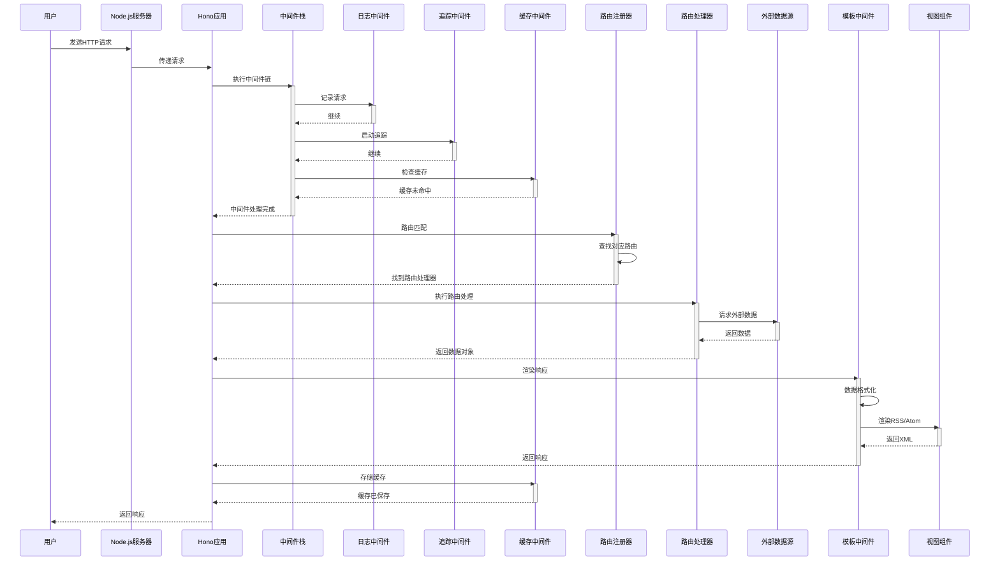
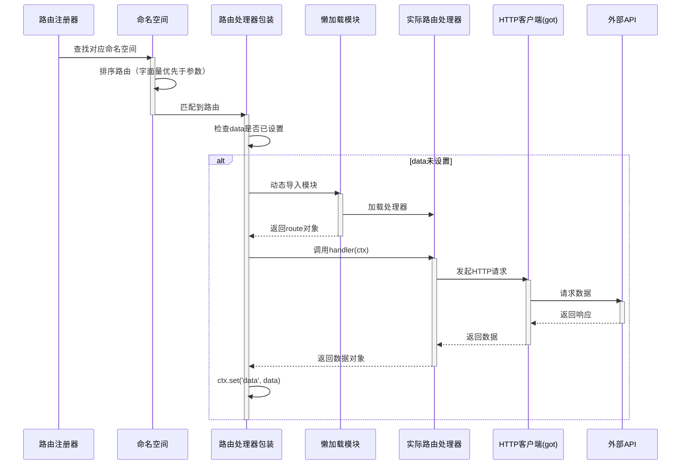
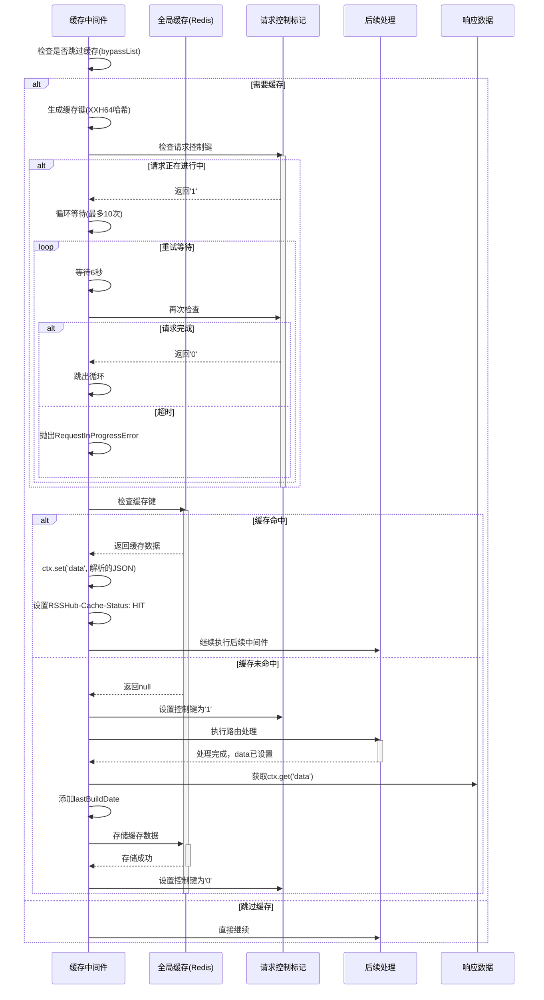
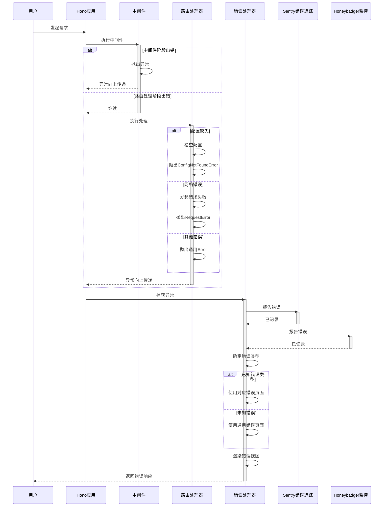
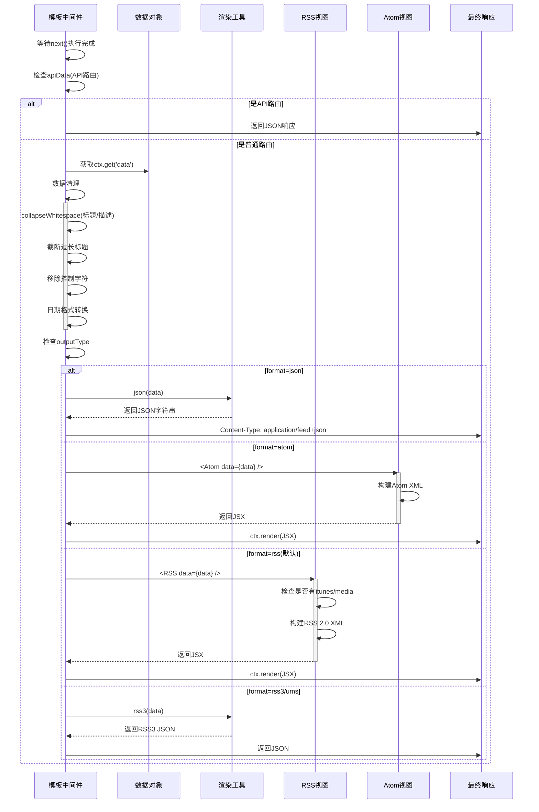

# RSSHub 时序图

## 1. 主流程时序图：用户请求到响应返回

### 图表解释

#### 1. 整体概述
这张图展示了RSSHub处理用户请求的完整生命周期：从HTTP请求进入服务器，经过中间件处理、路由匹配、数据获取、缓存，最终返回响应的全过程。核心是理解请求如何逐层传递和处理。

#### 2. 关键元素说明
- **用户 (User)**: RSSHub的使用者，发起HTTP请求获取RSS源
- **Hono应用 (App)**: 核心Web框架，负责请求路由和中间件协调
- **中间件栈 (Middleware)**: 一系列横切关注点处理组件，包括日志、追踪、缓存等
- **路由注册器 (Router)**: 管理所有路由定义，负责URL路径匹配
- **路由处理器 (Handler)**: 具体数据源的业务逻辑实现（如GitHub trending）
- **外部数据源 (External)**: RSSHub聚合的各种网站和API
- **模板中间件 (Template)**: 将数据渲染为RSS/Atom等格式

#### 3. 关键流程说明
1. **请求接收**: 服务器接收HTTP请求，传递给Hono应用
2. **中间件链执行**: 依次执行日志、追踪、缓存检查等中间件
3. **路由匹配**: Router根据请求路径找到对应的路由处理器
4. **数据获取**: 路由处理器请求外部数据源，处理并返回数据
5. **响应渲染**: 模板中间件将数据格式化为XML格式
6. **缓存存储**: 缓存中间件保存结果供后续请求使用
7. **响应返回**: 最终结果返回给用户

#### 4. 关键技术解释
- **Hono**: 轻量级Web框架，提供路由、中间件等功能
- **中间件模式**: 横切关注点分离，使代码更模块化
- **懒加载路由**: 路由处理器按需动态导入，减少启动时间
- **多级缓存**: 使用Redis作为全局缓存，提高响应速度

#### 5. 设计意图
- **可扩展性**: 通过中间件和路由注册机制，易于添加新功能和数据源
- **性能优化**: 缓存机制大幅减少重复请求的响应时间
- **可观测性**: 日志和追踪中间件便于问题诊断和性能分析
- **灵活性**: 支持多种输出格式（RSS、Atom、JSON等）

---

## 2. 子流程时序图1：路由匹配与处理详情

### 图表解释

#### 1. 整体概述
此图详细展示了路由匹配和处理的内部机制，重点是路由的排序策略、懒加载机制以及数据获取的具体过程。

#### 2. 关键元素说明
- **命名空间 (Namespace)**: 路由的分组组织，如github、zhihu等
- **路由处理器包装 (RouteHandler)**: 通用包装器，处理懒加载和数据流
- **懒加载模块 (LazyLoad)**: 动态导入系统，按需加载路由模块
- **实际路由处理器 (ActualHandler)**: 具体业务逻辑实现
- **HTTP客户端 (Got)**: 封装的HTTP请求库，处理网络请求

#### 3. 关键流程说明
1. **路由排序**: 字面量路径优先于参数路径（如`/trending`优先于`/:user`）
2. **懒加载**: 首次访问时才导入模块，减少内存占用
3. **数据获取**: 使用got库发起HTTP请求，获取外部数据
4. **数据处理**: 解析、清洗、转换数据为标准格式
5. **数据设置**: 将结果存入ctx，供后续中间件使用

#### 4. 关键技术解释
- **路由排序算法**: 比较路径段，字面量优先级高于参数
- **动态导入**: 使用`import()`实现按需加载
- **Cheerio**: 类jQuery的HTML解析库，用于网页抓取
- **数据标准化**: 统一的item结构，支持title、link、description等

#### 5. 设计意图
- **启动优化**: 懒加载减少初始内存和启动时间
- **路由精准度**: 排序确保更具体的路由优先匹配
- **代码组织**: 按命名空间组织，便于维护和扩展

---

## 3. 子流程时序图2：缓存处理详情

### 图表解释

#### 1. 整体概述
此图详细展示了RSSHub的缓存机制，包括缓存键生成、并发请求控制、缓存命中/未命中处理等核心逻辑。

#### 2. 关键元素说明
- **缓存中间件 (Cache)**: 协调缓存流程的核心组件
- **全局缓存 (GlobalCache)**: Redis缓存存储，支持分布式部署
- **请求控制标记 (RequestControl)**: 防止重复请求的控制机制
- **缓存键生成**: 使用XXH64哈希压缩路径+参数，减少键长度

#### 3. 关键流程说明
1. **生成缓存键**: 将请求路径、format、limit组合后哈希
2. **并发控制**: 通过控制键防止同一请求被多次同时处理
3. **缓存检查**: 查询Redis是否有缓存数据
4. **缓存命中**: 直接使用缓存，设置HIT标记
5. **缓存未命中**: 执行路由处理，保存结果到缓存

#### 4. 关键技术解释
- **XXH64**: 高性能哈希算法，用于生成简短的缓存键
- **请求控制**: 双重检查+等待机制，避免缓存击穿
- **TTL策略**: 根据缓存可用性设置ttl字段
- **条件缓存**: 支持Cache-Control: no-cache跳过缓存

#### 5. 设计意图
- **性能优先**: 大幅减少重复请求的响应时间
- **保护下游**: 防止对外部API的过度请求
- **可用性**: 即使缓存不可用也能正常工作
- **可观测**: 通过RSSHub-Cache-Status头了解缓存状态

---

## 4. 异常处理时序图

### 图表解释

#### 1. 整体概述
此图展示了RSSHub的异常处理机制，从错误发生、捕获、报告到最终返回友好错误页面的完整流程。

#### 2. 关键元素说明
- **错误处理器 (ErrorHandler)**: 统一的错误处理入口
- **Sentry/Honeybadger**: 第三方错误监控服务
- **错误类型**: ConfigNotFoundError、RequestError等专门错误类

#### 3. 关键流程说明
1. **错误发生**: 在中间件或路由处理阶段抛出异常
2. **异常传递**: 异常沿调用栈向上传递到Hono应用
3. **错误捕获**: onError钩子捕获所有未处理异常
4. **错误报告**: 向Sentry和Honeybadger发送错误信息
5. **错误响应**: 根据错误类型渲染对应错误页面

#### 4. 关键技术解释
- **集中错误处理**: Hono的onError机制统一处理所有异常
- **错误监控**: 集成Sentry和Honeybadger实现错误追踪
- **友好提示**: 为配置缺失等常见错误提供明确的解决指引
- **错误分类**: 使用自定义错误类区分不同错误场景

#### 5. 设计意图
- **可维护性**: 集中处理错误，避免重复代码
- **可观测性**: 错误监控帮助快速发现和定位问题
- **用户体验**: 友好的错误页面指导用户解决问题
- **鲁棒性**: 即使出错也能优雅降级，不影响整体服务

---

## 5. 数据渲染时序图：从数据到RSS/Atom

### 图表解释

#### 1. 整体概述
此图展示了从原始数据到最终响应格式（RSS/Atom/JSON）的渲染过程，包括数据清理、格式化和视图选择。

#### 2. 关键元素说明
- **模板中间件 (Template)**: 响应渲染的协调者
- **数据清理**: 确保数据符合XML规范
- **视图组件 (RSSView/AtomView)**: JSX组件，负责XML生成
- **渲染工具**: JSON、RSS3等格式的转换工具

#### 3. 关键流程说明
1. **数据获取**: 从ctx中获取路由处理器设置的data
2. **数据清理**: 处理空白、长度、非法字符等
3. **格式选择**: 根据format参数选择输出格式
4. **视图渲染**: 使用对应的视图组件生成XML
5. **响应返回**: 设置正确的Content-Type并返回

#### 4. 关键技术解释
- **JSX渲染**: 使用Hono的jsx-renderer直接渲染XML
- **多格式支持**: RSS 2.0、Atom 1.0、JSON Feed、RSS3
- **数据验证**: 确保输出符合各格式规范
- **媒体扩展**: 支持iTunes播客、Media RSS等扩展

#### 5. 设计意图
- **格式兼容**: 满足不同RSS阅读器的需求
- **可扩展**: 易于添加新的输出格式
- **数据质量**: 清理确保XML有效性，避免解析错误
- **开发者友好**: 提供debug.json等调试格式

---
*生成时间: 2026-05-13*
*模式: 深度*
*所属项目: RSSHub*
*文件包含: 5张时序图*
