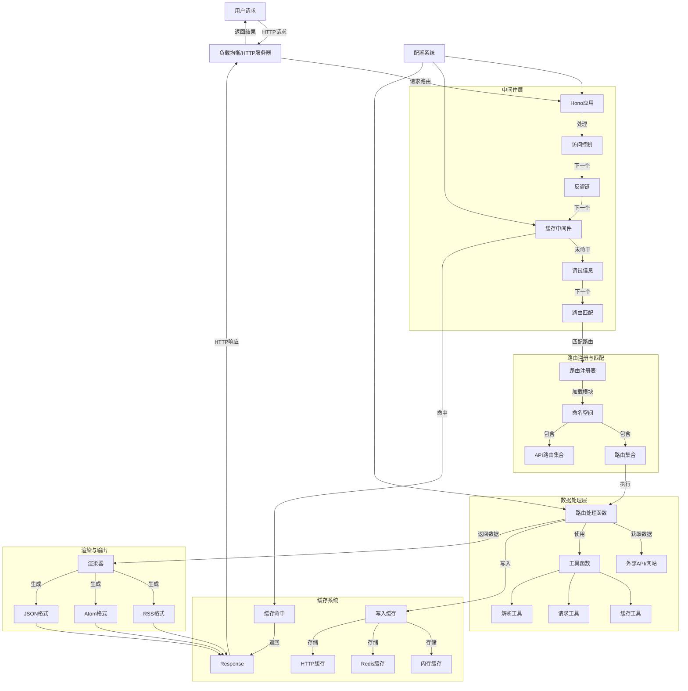

# RSSHub 数据流 E-R 图

## 1. 整体数据流图

## 2. 详细 E-R 图

```mermaid
erDiagram
    CONFIG {
        string id PK "配置ID"
        json appConfig "应用配置"
        json networkConfig "网络配置"
        json cacheConfig "缓存配置"
        json proxyConfig "代理配置"
        json accessConfig "访问控制配置"
        json routeSpecificConfig "路由特定配置"
        timestamp createdAt "创建时间"
        timestamp updatedAt "更新时间"
    }

    NAMESPACE {
        string name PK "命名空间名称"
        string url "网站URL"
        json categories "分类列表"
        string description "描述"
        string lang "主语言"
        json i18n "多语言支持"
    }

    ROUTE {
        string path PK "路由路径"
        string name "路由名称"
        string url "对应网站URL"
        json maintainers "维护者列表"
        string handlerFunction "处理函数名"
        string example "示例URL"
        json parameters "参数描述"
        string description "描述"
        json categories "分类"
        json features "功能特性"
        json radarRules "雷达规则"
        enum viewType "默认视图类型"
        string namespace FK "所属命名空间"
    }

    API_ROUTE {
        string path PK "API路由路径"
        json maintainers "维护者列表"
        string handlerFunction "处理函数名"
        json parameters "参数描述"
        string description "描述"
        string namespace FK "所属命名空间"
    }

    RSS_DATA {
        string id PK "数据ID"
        string title "Feed标题"
        string description "Feed描述"
        string link "Feed链接"
        string image "Feed图片"
        string author "作者"
        string language "语言"
        string feedLink "Feed链接"
        string lastBuildDate "最后构建日期"
        string itunesAuthor "iTunes作者"
        string itunesCategory "iTunes分类"
        boolean itunesExplicit "iTunes是否明确"
        string icon "图标"
        string logo "Logo"
        string atomlink "Atom链接"
        int ttl "TTL秒数"
    }

    DATA_ITEM {
        string id PK "条目ID"
        string title "条目标题"
        string description "描述"
        datetime pubDate "发布日期"
        string link "链接"
        json categories "分类"
        json author "作者信息"
        string doi "DOI"
        string guid "GUID"
        json content "内容"
        string image "图片"
        string banner "横幅"
        datetime updated "更新日期"
        string language "语言"
        string enclosureUrl "附件URL"
        string enclosureType "附件类型"
        string enclosureTitle "附件标题"
        int enclosureLength "附件长度"
        int itunesDuration "iTunes时长"
        string itunesItemImage "iTunes条目图片"
        json media "媒体信息"
        json attachments "附件"
        json extra "额外信息"
        string rssDataId FK "所属Feed"
    }

    CACHE_ENTRY {
        string key PK "缓存键"
        string value "缓存值(JSON)"
        int expireTime "过期时间(秒)"
        string cacheType "缓存类型"
        datetime createdAt "创建时间"
    }

    NAMESPACE ||--o{ ROUTE : "包含"
    NAMESPACE ||--o{ API_ROUTE : "包含"
    ROUTE ||--o{ RSS_DATA : "生成"
    RSS_DATA ||--o{ DATA_ITEM : "包含"
    CONFIG ||--o{ NAMESPACE : "配置"
    CONFIG ||--o{ ROUTE : "配置"
    ROUTE ||--o{ CACHE_ENTRY : "使用"
    API_ROUTE ||--o{ CACHE_ENTRY : "使用"
```

## 3. 数据字典

### 3.1 配置系统 (Config)

| 字段名 | 类型 | 说明 | 示例值 |
|--------|------|------|--------|
| `disallowRobot` | boolean | 是否禁止爬虫 | `false` |
| `enableCluster` | boolean | 是否启用集群模式 | `false` |
| `isPackage` | boolean | 是否作为包使用 | `false` |
| `nodeName` | string | 节点名称 | `node-1` |
| `connect.port` | number | 监听端口 | `1200` |
| `listenInaddrAny` | boolean | 是否允许公网访问 | `true` |
| `disableIPv6` | boolean | 是否禁用IPv6 | `false` |
| `requestRetry` | number | 请求重试次数 | `2` |
| `requestTimeout` | number | 请求超时(ms) | `30000` |
| `ua` | string | 用户代理 | `Mozilla/5.0...` |
| `isDefaultUA` | boolean | 是否为默认UA | `true` |
| `trueUA` | string | 真实UA | `RSSHub/1.0` |
| `allowOrigin` | string | CORS允许的来源 | `*` |
| `cache.type` | string | 缓存类型 | `memory` |
| `cache.requestTimeout` | number | 缓存请求超时 | `60` |
| `cache.routeExpire` | number | 路由缓存过期(秒) | `300` |
| `cache.contentExpire` | number | 内容缓存过期(秒) | `3600` |
| `memory.max` | number | 内存缓存最大项数 | `256` |
| `redis.url` | string | Redis URL | `redis://localhost:6379` |
| `httpCache.url` | string | HTTP缓存URL |  |
| `httpCache.token` | string | HTTP缓存Token |  |

### 3.2 命名空间 (Namespace)

| 字段名 | 类型 | 必填 | 说明 |
|--------|------|------|------|
| `name` | string | 是 | 命名空间名称(人类可读) |
| `url` | string | 否 | 对应网站URL(不含协议) |
| `categories` | Category[] | 否 | 分类列表 |
| `description` | string | 否 | 用户提示和附加说明 |
| `lang` | Language | 否 | 命名空间主语言 |
| `ja` | NamespaceItem | 否 | 日语版本 |
| `zh` | NamespaceItem | 否 | 简体中文版本 |
| `zh-TW` | NamespaceItem | 否 | 繁体中文版本 |

### 3.3 路由 (Route)

| 字段名 | 类型 | 必填 | 说明 |
|--------|------|------|------|
| `path` | string \| string[] | 是 | 路由路径(使用Hono路由语法) |
| `name` | string | 是 | 路由名称(人类可读) |
| `url` | string | 否 | 对应网站URL(不含协议) |
| `maintainers` | string[] | 是 | 维护者GitHub handle列表 |
| `handler` | function | 是 | 路由处理函数 |
| `example` | string | 是 | 路由示例URL |
| `parameters` | Record | 否 | 路由参数描述 |
| `description` | string | 否 | 路由使用提示和说明(支持Markdown) |
| `categories` | Category[] | 否 | 分类列表 |
| `features` | Object | 否 | 路由特殊功能 |
| `features.requireConfig` | Array \| false | 否 | 所需配置项 |
| `features.requirePuppeteer` | boolean | 否 | 是否使用Puppeteer |
| `features.antiCrawler` | boolean | 否 | 目标网站是否有反爬虫机制 |
| `features.supportRadar` | boolean | 否 | 是否支持雷达规则 |
| `features.supportBT` | boolean | 否 | 是否支持BitTorrent |
| `features.supportPodcast` | boolean | 否 | 是否支持播客 |
| `features.supportScihub` | boolean | 否 | 是否支持Sci-Hub |
| `features.nsfw` | boolean | 否 | 是否NSFW内容 |
| `radar` | RadarItem[] | 否 | 雷达规则 |
| `view` | ViewType | 否 | Follow默认视图类型 |

### 3.4 数据结构 (Data & DataItem)

#### 3.4.1 Data (Feed数据)

| 字段名 | 类型 | 必填 | 说明 |
|--------|------|------|------|
| `title` | string | 是 | Feed标题 |
| `description` | string | 否 | Feed描述 |
| `link` | string | 否 | Feed链接 |
| `item` | DataItem[] | 否 | 条目列表 |
| `allowEmpty` | boolean | 否 | 是否允许空Feed |
| `image` | string | 否 | Feed图片 |
| `author` | string | 否 | 作者 |
| `language` | Language | 否 | 语言 |
| `feedLink` | string | 否 | Feed链接 |
| `lastBuildDate` | string | 否 | 最后构建日期 |
| `itunes_author` | string | 否 | iTunes作者 |
| `itunes_category` | string | 否 | iTunes分类 |
| `itunes_explicit` | string \| boolean | 否 | iTunes是否明确 |
| `id` | string | 否 | ID |
| `icon` | string | 否 | 图标 |
| `logo` | string | 否 | Logo |
| `atomlink` | string | 否 | Atom链接 |
| `ttl` | number | 否 | TTL秒数 |

#### 3.4.2 DataItem (条目数据)

| 字段名 | 类型 | 必填 | 说明 |
|--------|------|------|------|
| `title` | string | 是 | 条目标题 |
| `description` | string | 否 | 描述 |
| `pubDate` | number \| string \| Date | 否 | 发布日期 |
| `link` | string | 否 | 链接 |
| `category` | string[] | 否 | 分类 |
| `author` | string \| Array | 否 | 作者信息 |
| `doi` | string | 否 | DOI |
| `guid` | string | 否 | GUID |
| `id` | string | 否 | ID |
| `content` | { html, text } | 否 | 内容 |
| `image` | string | 否 | 图片 |
| `banner` | string | 否 | 横幅 |
| `updated` | number \| string \| Date | 否 | 更新日期 |
| `language` | Language | 否 | 语言 |
| `enclosure_url` | string | 否 | 附件URL |
| `enclosure_type` | string | 否 | 附件类型 |
| `enclosure_title` | string | 否 | 附件标题 |
| `enclosure_length` | number | 否 | 附件长度 |
| `itunes_duration` | number \| string | 否 | iTunes时长 |
| `itunes_item_image` | string | 否 | iTunes条目图片 |
| `media` | Record | 否 | 媒体信息 |
| `attachments` | Array | 否 | 附件列表 |
| `_extra` | Record | 否 | 额外信息 |

### 3.5 分类 (Category)

RSSHub 支持以下分类：

- `popular` - 热门
- `social-media` - 社交媒体
- `new-media` - 新媒体
- `traditional-media` - 传统媒体
- `bbs` - 论坛
- `blog` - 博客
- `programming` - 编程
- `design` - 设计
- `live` - 直播
- `multimedia` - 多媒体
- `picture` - 图片
- `anime` - 动漫
- `program-update` - 程序更新
- `university` - 大学
- `forecast` - 预报
- `travel` - 旅游
- `shopping` - 购物
- `game` - 游戏
- `reading` - 阅读
- `government` - 政府
- `study` - 学习
- `journal` - 期刊
- `finance` - 金融
- `sport` - 体育
- `other` - 其他

### 3.6 视图类型 (ViewType)

| 值 | 说明 |
|----|------|
| `0` | Articles - 文章视图 |
| `1` | SocialMedia - 社交媒体视图 |
| `2` | Pictures - 图片视图 |
| `3` | Videos - 视频视图 |
| `4` | Audios - 音频视图 |
| `5` | Notifications - 通知视图 |

## 4. 核心数据流转过程

### 4.1 路由注册流程

1. 应用启动时，`registry.ts` 从 `./routes` 目录导入所有模块
2. 识别模块类型：`namespace`、`route` 或 `apiRoute`
3. 将路由按命名空间组织到 `namespaces` 对象中
4. 根据配置决定是否过滤NSFW内容
5. 使用 `app.ts` 将路由注册到Hono应用

### 4.2 请求处理流程

1. 请求到达Hono应用
2. 中间件链处理：
   - 访问控制验证
   - 反盗链检查
   - 缓存查询：
     - 计算缓存键(路径+格式+limit参数)
     - 检查是否有进行中的相同请求
     - 命中缓存则直接返回
   - 调试信息处理
3. 路由匹配，找到对应的处理函数
4. 执行路由处理函数：
   - 可能访问外部API或网站
   - 处理数据为标准Data格式
   - 可能使用Puppeteer进行渲染
5. 渲染为RSS/Atom/JSON格式
6. 写入缓存(如果配置允许)
7. 返回响应

### 4.3 缓存机制

- **缓存键生成**：`rsshub:koa-redis-cache:{hash(path+format+limit)}`
- **控制键**：防止重复请求的并发控制
- **缓存类型**：memory、redis、http
- **过期策略**：路由缓存(config.cache.routeExpire)、内容缓存(config.cache.contentExpire)

## 5. 数据验证与约束

1. **路由路径**：必须符合Hono路由语法
2. **命名空间**：名称唯一，作为二级路径
3. **维护者**：每个路由必须指定维护者
4. **参数**：路径参数必须在parameters中说明
5. **示例**：每个路由必须提供有效示例URL
6. **Feed数据**：title字段必填，item数组可选但通常应该有数据
7. **条目标题**：DataItem的title字段必填

