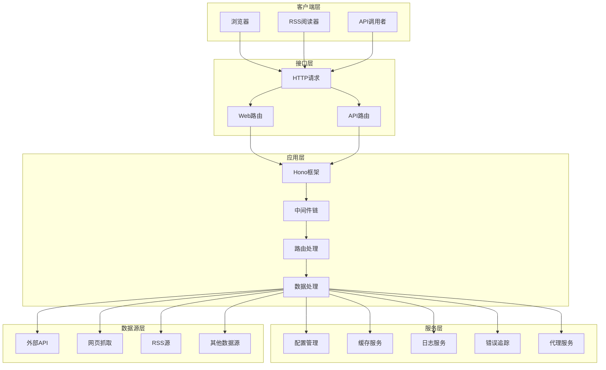
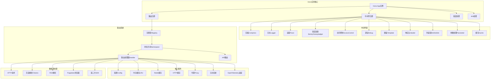
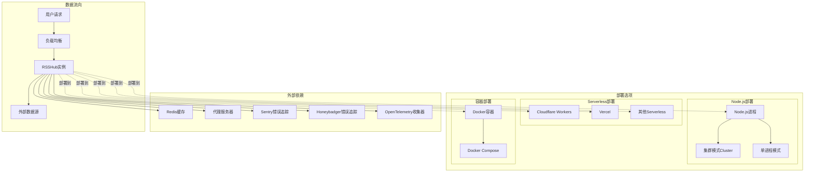

# RSSHub 系统架构图 (System Architecture)

## 1. 高层架构图

### 图表解释

#### 1. 整体概述
这张图展示了 RSSHub 系统的整体分层架构，从客户端请求到数据获取的完整流程。核心价值在于将各种数据源统一转换为标准 RSS 格式。

#### 2. 关键元素说明
- **客户端层**：最终用户的入口，包括浏览器、RSS 阅读器和 API 调用者
- **接口层**：处理 HTTP 请求，区分 Web 路由和 API 路由
- **应用层**：核心业务逻辑所在，基于 Hono 框架
- **服务层**：提供配置、缓存、日志、错误追踪和代理等基础设施服务
- **数据源层**：从外部世界获取原始数据的各种方式

#### 3. 关键流程/关系说明
- 客户端发起 HTTP 请求 → 接口层路由分发 → 应用层处理逻辑 → 服务层支持 → 数据源层获取原始数据 → 反向返回处理结果

#### 4. 关键技术解释
- **Hono 框架**：轻量级 Web 框架，支持多种运行环境（Node.js、Cloudflare Workers 等）
- **中间件链模式**：请求处理的链式责任模式，便于功能扩展
- **多数据源适配**：统一接口适配各种外部数据源

#### 5. 设计意图
- **分层设计**：清晰的职责分离，每层专注自己的功能
- **可扩展性**：新的数据源和路由可以轻松添加
- **多环境支持**：同一套代码可以部署到多种平台

---

## 2. 详细组件图

### 图表解释

#### 1. 整体概述
这张图深入展示了 RSSHub 内部的详细组件结构，重点呈现了中间件链、路由系统和核心服务之间的关系。

#### 2. 关键元素说明
- **Hono应用核心**：应用的入口点，负责注册中间件、路由和错误处理
- **中间件链**：11个中间件组成的处理管道，按顺序执行
- **路由系统**：基于命名空间组织的路由注册表，支持动态加载
- **核心服务**：配置、缓存（内存/Redis/HTTP）、代理、日志、追踪等基础设施
- **数据源处理**：多种数据获取和解析方式

#### 3. 关键流程/关系说明
- 请求进入 → 按顺序通过中间件链 → 匹配路由 → 执行路由处理器 → 使用核心服务获取和处理数据 → 返回结果

#### 4. 关键技术解释
- **中间件链**：Hono 的洋葱圈模式，请求先从外到内，响应再从内到外
- **动态路由加载**：开发时从目录导入，生产时使用预构建的路由文件
- **多级缓存**：内存缓存 → Redis 缓存 → HTTP 缓存的三级缓存策略
- **环境变量配置**：基于 dotenv 的配置系统，支持远程配置加载

#### 5. 设计意图
- **中间件解耦**：每个中间件专注单一功能，可灵活组合
- **路由模块化**：按命名空间组织，便于维护和扩展
- **缓存策略**：多级缓存提高性能，减轻数据源压力
- **可观测性**：集成日志、错误追踪和性能追踪，便于监控和调试

---

## 3. 部署架构图

### 图表解释

#### 1. 整体概述
这张图展示了 RSSHub 的多种部署方式和外部依赖关系，说明如何在不同环境中运行 RSSHub。

#### 2. 关键元素说明
- **Node.js部署**：传统部署方式，支持集群模式（利用多核CPU）或单进程模式
- **Serverless部署**：部署到 Cloudflare Workers、Vercel 等无服务器平台
- **容器部署**：使用 Docker 容器化部署，支持 Docker Compose 编排
- **外部依赖**：Redis 缓存、代理服务器、错误追踪服务、OpenTelemetry 收集器等

#### 3. 关键流程/关系说明
- 用户请求 → 负载均衡 → RSSHub 实例 → （可选）使用外部依赖 → 获取外部数据源 → 返回 RSS 结果

#### 4. 关键技术解释
- **集群模式**：使用 Node.js cluster 模块，主进程 fork 多个 worker 进程
- **Cloudflare Workers**：边缘计算平台，全球分布，低延迟
- **Docker 容器化**：确保环境一致性，便于部署和扩展
- **多级部署支持**：同一套代码通过不同入口文件支持多种运行环境

#### 5. 设计意图
- **灵活性**：支持从个人设备到大规模生产环境的各种部署场景
- **性能优化**：集群模式和边缘部署提高并发处理能力
- **可观测性**：集成多种监控和错误追踪服务
- **降低成本**：Serverless 部署按需付费，适合流量波动场景

---

*生成时间: 2026-05-13*
*模式: 深度*
*所属项目: RSSHub*
*文件包含: 3 张图*
