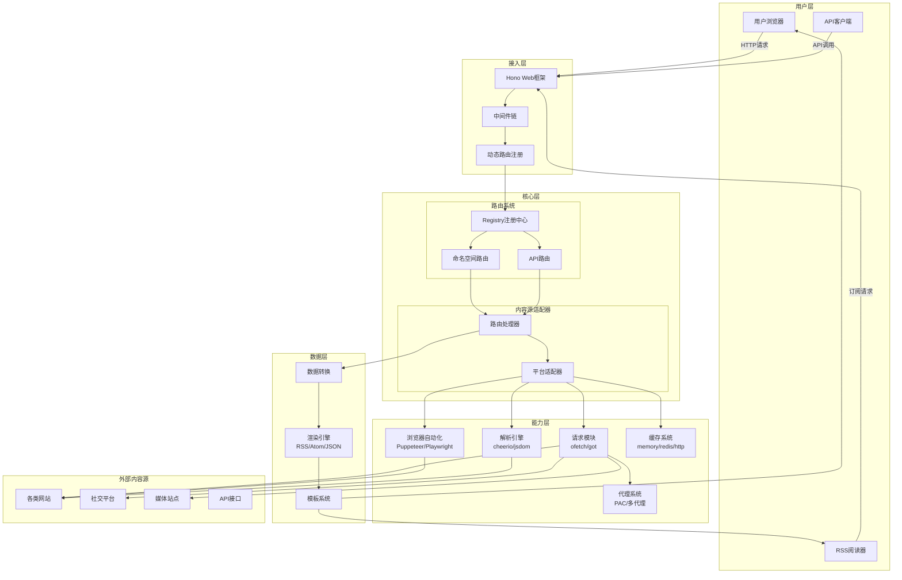
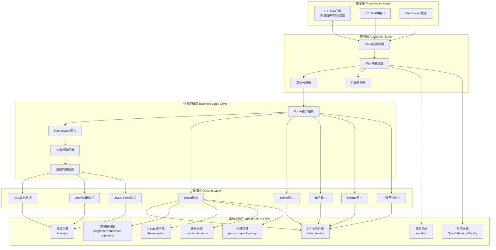
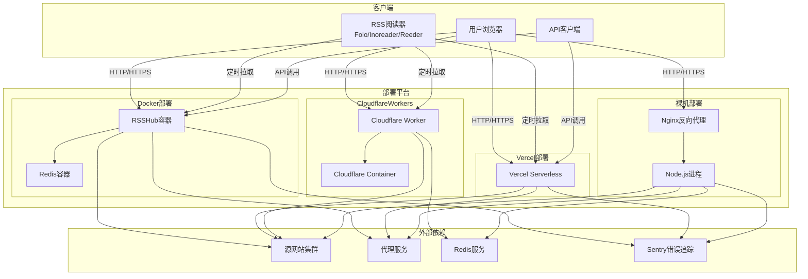

# RSSHub 系统架构图 (System Architecture Diagram)

## 1. 整体系统架构图



### 图表解释

#### 1. 整体概述

这张图展示了 RSSHub 系统的完整拓扑结构，采用分层架构将系统划分为六个纵向层次：用户层、接入层、核心层、能力层、数据层和外部内容源。RSSHub 是一个开源 RSS 聚合器，能够将各种网站内容转换为标准的 RSS/Atom/JSON 格式输出，让用户可以通过 RSS 阅读器订阅原本不支持 RSS 的网站。

#### 2. 关键元素说明

用户层包含三类消费者：普通用户通过浏览器访问 RSSHub 生成的订阅源，RSS 阅读器（如 Folo、Inoreader、Reeder 等）定期拉取订阅更新，API 客户端直接调用 RSSHub 的 API 接口获取结构化数据。接入层基于 Hono 轻量级 Web 框架构建，负责接收所有 HTTP 请求，中间件链按顺序处理请求（日志、追踪、认证、调试、模板、缓存等），动态路由注册器将 URL 映射到对应的路由处理器。核心层是 RSSHub 的业务中枢，Registry 注册中心负责加载和管理数百个命名空间路由，每个命名空间对应一个内容平台（如 Bilibili、Twitter、知乎等），路由处理器执行具体的内容抓取逻辑，平台适配器封装不同网站的访问方式。能力层提供通用技术能力：请求模块负责 HTTP 通信，浏览器自动化处理需要 JavaScript 渲染的页面，解析引擎从 HTML 中提取结构化数据，缓存系统减少重复请求，代理系统处理网络访问策略。数据层负责将抓取到的原始数据转换为标准输出格式：数据转换进行字段映射和清洗，渲染引擎生成 RSS 2.0、Atom 或 JSON Feed 格式，模板系统负责 XML/HTML 输出渲染。外部内容源是 RSSHub 需要抓取的各类网站和平台。

#### 3. 关键流程/关系说明

用户发起订阅请求后，请求首先进入 Hono Web 框架，经过中间件链的层层处理：trace 中间件生成请求追踪 ID，logger 记录访问日志，honeybadger/sentry 进行错误监控，accessControl 进行访问控制，debug 中间件处理调试信息，template 中间件准备渲染模板，header 中间件设置响应头，antiHotlink 处理防盗链，parameter 处理请求参数，cache 中间件检查缓存命中。随后请求到达 Registry 注册中心，Registry 根据 URL 路径匹配对应的命名空间路由（如 `/bilibili/user/dynamic/:uid` 匹配到 Bilibili 命名空间的用户动态路由）。路由处理器调用平台适配器，适配器根据目标网站的特性选择抓取方式：对于提供 API 的网站直接发起 HTTP 请求，对于需要登录或渲染的网站使用 Puppeteer 模拟浏览器访问，对于静态页面使用 cheerio 解析 HTML。获取的原始数据经过字段映射、内容清洗、去重处理后，由渲染引擎根据请求的 format 参数（rss/atom/json/rss3）生成对应格式的输出，最终通过模板系统渲染为完整的 XML/JSON 响应返回给客户端。

#### 4. 关键技术解释

Hono 是一个基于 Web 标准的轻量级 JavaScript 框架，专为边缘计算环境设计，具有极低的启动延迟和出色的运行时性能。RSSHub 使用 Hono 替代了早期的 Koa 框架，以获得更好的 TypeScript 支持和跨平台兼容性（Node.js、Cloudflare Workers、Deno 等）。Registry 注册中心采用动态导入机制，在开发环境通过 `directoryImport` 自动扫描 `lib/routes` 目录加载路由模块，在生产环境使用预构建的 `routes.js` 减少启动时间。每个路由模块导出一个 `Route` 对象，包含路径定义、处理器函数和元数据。缓存系统采用多级策略：内存缓存（基于 lru-cache）用于高频访问数据，Redis 缓存用于分布式部署场景，HTTP 缓存用于外部缓存服务集成。请求去重机制通过 xxhash 生成请求指纹，配合 Redis 控制键防止并发重复请求。代理系统支持 PAC 脚本、多代理轮询和故障转移，适应不同网络环境。

#### 5. 设计意图

分层架构的核心目的是将复杂的内容聚合问题分解为可管理的子问题。用户层与接入层的分离使得 RSSHub 可以同时支持浏览器访问、RSS 阅读器订阅和 API 调用三种使用模式。核心层的命名空间路由设计使得新增一个内容源只需要在 `lib/routes` 下添加一个新的路由模块，无需修改核心代码，这体现了开闭原则（OCP）。能力层的技术组件封装使得底层实现可以独立演进：例如从 got 迁移到 ofetch 作为 HTTP 客户端时，路由处理器无需修改。缓存层的引入解决了 RSS 阅读器频繁轮询带来的性能问题，通过合理的缓存策略在保证实时性的同时大幅降低对源站的请求压力。整个架构遵循"约定优于配置"的原则，路由模块只需实现简单的接口即可自动注册到系统中，降低了社区贡献的门槛。

---

## 2. 分层架构图



### 图表解释

#### 1. 整体概述

这张图从软件工程的分层视角重新审视 RSSHub，采用经典的五层架构模式：表示层、应用层、业务逻辑层、领域层和基础设施层。与第一幅图的整体架构视角不同，这张图更强调代码的组织结构和依赖方向——上层可以调用下层，但下层不能反向依赖上层，形成严格的单向依赖关系。

#### 2. 关键元素说明

表示层负责与用户交互，包含 HTTP 客户端（浏览器、RSS 阅读器、curl 等）、REST API 接口（供程序化调用）和 WebSocket 推送（用于实时通知）。应用层是系统的编排中心，Hono 应用实例是 HTTP 服务器的核心，中间件编排器按顺序执行各个中间件，路由分发器将请求映射到对应处理器，错误处理器统一处理异常并返回友好的错误页面。业务逻辑层定义了系统的契约接口：Route 接口抽象规定每个路由必须实现的方法集，Namespace 聚合将相关路由组织在一起，内容抓取逻辑封装数据获取流程，数据转换规则定义原始数据到标准格式的映射。领域层是业务逻辑的具体实现，包含数百个平台路由（Bilibili、Twitter、知乎、GitHub 等）和三种输出格式实现（RSS 2.0、Atom、JSON Feed）。基础设施层提供技术能力支撑，包括 HTTP 通信、浏览器自动化、HTML 解析、缓存存储、代理管理、日志记录、监控追踪和模板渲染。

#### 3. 关键流程/关系说明

表示层的 HTTP 客户端向应用层发起请求，Hono 应用实例接收请求后交给中间件编排器。编排器依次执行日志记录、请求追踪、访问控制、调试信息附加、模板准备、响应头设置、防盗链处理、参数解析和缓存检查。路由分发器根据 URL 路径匹配业务逻辑层的 Route 接口，Route 接口通过 Namespace 聚合找到具体的领域层路由实现（如 Bilibili 路由）。领域层路由调用基础设施层的 HTTP 客户端或浏览器引擎获取原始内容，通过 HTML 解析器提取数据，然后返回给业务逻辑层进行数据转换。转换后的数据根据请求的格式类型（rss/atom/json）选择对应的领域层输出格式实现，最终通过基础设施层的模板引擎渲染为响应内容返回给客户端。错误处理器捕获各层抛出的异常，统一渲染错误页面。

#### 4. 关键技术解释

业务逻辑层的 Route 接口采用 TypeScript 类型定义，确保每个路由模块都实现必需的属性和方法。以 Route 接口为例，它定义了 `path`（路径）、`name`（名称）、`maintainers`（维护者）、`handler`（处理器函数）等字段，各平台路由必须满足该接口契约。这种设计使得 Registry 注册中心可以统一加载和管理所有路由，而无需关心具体平台差异。依赖注入体现在领域层对基础设施的使用上：路由处理器并不直接实例化 HTTP 客户端，而是通过统一的请求工具函数发起请求，便于测试时替换为 Mock 对象。模板引擎使用 Hono 内置的 JSX 渲染器，支持在服务端渲染 JSX 组件为 XML/HTML 字符串，这使得 RSS 和 Atom 模板的编写具有组件化、类型安全的优势。

#### 5. 设计意图

分层架构的首要目标是控制复杂度。通过将系统拆分为五个层次，每一层只需关注本层的职责，降低了认知负担。严格的单向依赖规则（上层依赖下层，下层不依赖上层）保证了系统的可测试性：可以单独测试领域层的路由逻辑，无需启动完整 HTTP 服务器；可以为 HTTP 客户端编写 Mock 实现，在隔离网络的情况下测试数据转换逻辑。另一个重要目标是可替换性：当需要更换 Web 框架时，只需修改应用层；当需要支持新的输出格式时，只需在领域层新增一个格式实现，无需改动其他层次。这种架构模式遵循了依赖倒置原则（DIP）和开闭原则（OCP）。对于 RSSHub 这样一个拥有数百个路由、社区贡献活跃的项目，分层架构还起到了代码组织的作用——每个路由模块只需关注领域层的实现，无需了解 HTTP 服务器、缓存、日志等横切关注点的细节。

---

## 3. 技术栈架构图

```mermaid
graph TB
    subgraph 编程语言与运行时
        Node[Node.js 22+]
        TS[TypeScript 5.9]
        TSX[tsx 运行时]
    end

    subgraph Web框架与服务器
        Hono[Hono 4.12]
        HonoNode[@hono/node-server]
        HonoOpenAPI[@hono/zod-openapi]
    end

    subgraph 数据获取与解析
        OFetch[ofetch 1.5]
        Undici[undici 7.25]
        Cheerio[cheerio 1.2]
        JSDOM[jsdom 29.1]
        RSSParser[rss-parser 3.13]
    end

    subgraph 浏览器自动化
        Puppeteer[rebrowser-puppeteer 24.8]
        PWReal[puppeteer-real-browser 1.4]
        CFPP[@cloudflare/puppeteer]
    end

    subgraph 缓存与存储
        LRU[lru-cache 11.3]
        Redis[ioredis 5.10]
        XXHash[xxhash-wasm 1.1]
    end

    subgraph 代理与网络
        ProxyChain[proxy-chain 2.7]
        PACProxy[pac-proxy-agent]
        MultiProxy[multi-proxy]
        SocksProxy[socks-proxy-agent]
    end

    subgraph 数据验证与转换
        Zod[zod 4.3]
        DayJS[dayjs 1.11]
        Entities[entities 8.0]
        Sanitize[sanitize-html 2.17]
    end

    subgraph 可观测性
        Winston[winston 3.19]
        Sentry[@sentry/node 10.50]
        Honeybadger[@honeybadger-io/js 6.12]
        OTel[@opentelemetry/* 0.215]
    end

    subgraph 部署与构建
        TSDown[tsdown 0.21]
        Wrangler[wrangler 4.82]
        Docker[Docker容器]
        Vercel[Vercel平台]
    end

    Node --> TS
    TS --> TSX
    TSX --> Hono
    Hono --> HonoNode
    Hono --> HonoOpenAPI

    Node --> OFetch
    Node --> Undici
    OFetch --> Undici
    Node --> Cheerio
    Node --> JSDOM
    Node --> RSSParser

    Node --> Puppeteer
    Puppeteer --> PWReal
    Puppeteer --> CFPP

    Node --> LRU
    Node --> Redis
    Node --> XXHash

    Node --> ProxyChain
    Node --> PACProxy
    Node --> MultiProxy
    Node --> SocksProxy

    Node --> Zod
    Node --> DayJS
    Node --> Entities
    Node --> Sanitize

    Node --> Winston
    Node --> Sentry
    Node --> Honeybadger
    Node --> OTel

    TS --> TSDown
    TSDown --> Wrangler
    TSDown --> Docker
    TSDown --> Vercel
```

### 图表解释

#### 1. 整体概述

这张图展示了 RSSHub 所依赖的全部第三方技术组件及其版本信息，按照功能领域进行分组。Node.js 22+ 作为基础运行时，TypeScript 提供类型安全，在此之上构建了 Web 服务、数据获取、浏览器自动化、缓存存储、代理网络、数据验证、可观测性和部署构建九大技术领域。箭头表示组件间的依赖关系，如 ofetch 依赖 undici 作为底层 HTTP 实现，Hono 依赖 @hono/node-server 在 Node.js 环境中运行。

#### 2. 关键元素说明

Node.js 22+ 是系统的运行时基座，选择 22 版本是为了使用最新的 V8 引擎特性和稳定的 Fetch API 支持。TypeScript 5.9 提供静态类型检查和现代语言特性（如装饰器、类型谓词等），tsx 作为 TypeScript 执行器支持直接运行 .ts 文件而无需预编译。Web 框架组中，Hono 是一个基于 Web 标准的轻量级框架，支持 Edge Runtime；@hono/node-server 提供 Node.js 特定的服务器功能；@hono/zod-openapi 集成 Zod 数据验证和 OpenAPI 文档生成。数据获取组中，ofetch 是 unjs 生态的现代化 HTTP 客户端，基于 undici 构建；cheerio 提供类 jQuery 的 HTML 解析 API；jsdom 实现完整的 DOM API 用于服务端渲染；rss-parser 用于解析外部 RSS 源。浏览器自动化组中，rebrowser-puppeteer 是 Puppeteer 的分支，针对反检测进行了优化；puppeteer-real-browser 支持连接真实浏览器实例；@cloudflare/puppeteer 是 Cloudflare Workers 兼容版本。缓存组中，lru-cache 提供内存中的 LRU 缓存；ioredis 是 Redis 的 Node.js 客户端；xxhash-wasm 提供高性能的哈希算法用于缓存键生成。代理组包含多种代理协议支持：HTTP 代理链、PAC 脚本代理、多代理轮询和 SOCKS 代理。数据验证组中，Zod 提供运行时类型验证；dayjs 处理日期时间；entities 处理 HTML 实体编码；sanitize-html 清理不安全的 HTML 内容。可观测性组中，winston 是日志库；Sentry 和 Honeybadger 是错误追踪服务；OpenTelemetry 提供指标和链路追踪。部署构建组中，tsdown 是基于 Rolldown 的 TypeScript 打包器；wrangler 是 Cloudflare Workers 的 CLI 工具；Docker 和 Vercel 是部署目标平台。

#### 3. 关键流程/关系说明

TypeScript 代码通过 tsx 在开发环境直接执行，通过 tsdown 打包为 JavaScript 后在生产环境运行。Hono 应用构建在 Node.js 的 HTTP 服务器之上，@hono/node-server 将 Hono 的 Web 标准 Request/Response API 适配为 Node.js 的 http 模块。数据获取流程中，路由处理器调用 ofetch 发起 HTTP 请求，ofetch 底层使用 undici 作为 HTTP 客户端，支持 HTTP/2、连接池和流式响应。对于需要 JavaScript 渲染的页面，路由处理器调用 rebrowser-puppeteer 控制 Chromium 浏览器实例，获取渲染后的 DOM 内容，再通过 cheerio 或 jsdom 解析提取数据。缓存系统根据配置选择后端：开发环境使用 lru-cache 内存缓存，生产环境可选择 Redis 分布式缓存或外部 HTTP 缓存服务，xxhash-wasm 用于生成缓存键的哈希值。代理系统根据目标 URL 和配置策略选择代理服务器，支持 PAC 脚本动态决策和多代理故障转移。所有请求和错误信息通过 winston 记录日志，关键错误上报到 Sentry 或 Honeybadger，系统指标通过 OpenTelemetry 导出到 Prometheus。

#### 4. 关键技术解释

Hono 的设计理念是"基于 Web 标准、轻量、快速"。与 Express/Koa 不同，Hono 使用 Web 标准的 Request/Response 对象而非 Node.js 特定的 req/res 对象，这使得同一份代码可以在 Node.js、Cloudflare Workers、Deno、Bun 等多个运行时上运行。Hono 的中间件机制与 Express 类似，通过 `app.use()` 注册中间件，每个中间件可以修改请求上下文或提前返回响应。ofetch 是对原生 fetch 的增强封装，自动处理 JSON 解析、超时控制、重试逻辑和错误处理，同时保持与 fetch 相同的 API 风格。rebrowser-puppeteer 针对反爬虫检测进行了优化，通过修改浏览器指纹（如 navigator.webdriver、plugins、languages 等）使自动化浏览器更难被检测。Zod 的架构设计强调"类型即模式"，通过 Zod schema 定义可以同时获得 TypeScript 类型和运行时验证，与 Hono 的 @hono/zod-openapi 集成后可以自动生成 OpenAPI 文档和请求参数验证。

#### 5. 设计意图

技术栈的选择遵循了"现代标准优先、性能优先、类型安全"的原则。Hono 替代 Koa 体现了向 Web 标准迁移的趋势，减少了对 Node.js 特定 API 的依赖，为未来部署到边缘计算平台（Cloudflare Workers、Vercel Edge）打下基础。ofetch 替代 got 体现了对原生 fetch API 的拥抱，减少了第三方依赖的体积和复杂度。TypeScript 的全栈使用使得从配置、路由到模板都具有类型安全，在开发阶段就能捕获类型错误，提高了代码质量和可维护性。多平台部署支持（Docker、Vercel、Cloudflare Workers）体现了 RSSHub 作为社区项目的灵活性——用户可以根据自己的基础设施选择最合适的部署方式。可观测性工具的集成（Sentry、Honeybadger、OpenTelemetry）使得社区维护者能够及时发现和定位生产环境问题，对于一个拥有数千个实例的分布式系统至关重要。

---

## 4. 部署架构图



### 图表解释

#### 1. 整体概述

这张图描述了 RSSHub 在生产环境中的物理部署拓扑，展示了客户端、多种部署平台和外部依赖之间的网络通信关系。与前面的逻辑架构图不同，这张图关注的是组件运行在哪个进程、哪个平台上，以及它们之间使用什么协议通信。RSSHub 支持多种部署方式，适应不同用户的技术栈和基础设施条件。

#### 2. 关键元素说明

客户端包含三类消费者：浏览器用于直接访问 RSSHub 的 Web 界面和订阅源，RSS 阅读器定期拉取订阅更新，API 客户端调用 RSSHub 的 API 接口。部署平台包含四种主要方式：Docker 部署通过容器化运行 RSSHub 和可选的 Redis 缓存；Vercel 部署利用 Serverless 架构自动扩缩容；Cloudflare Workers 部署在边缘节点运行，配合 Cloudflare Containers 执行浏览器自动化任务；裸机部署通过 Node.js 进程直接运行，Nginx 作为反向代理处理静态资源和负载均衡。外部依赖包括需要抓取的源网站集群、代理服务（用于访问受限网站）、Redis 服务（用于分布式缓存）和 Sentry 错误追踪服务。

#### 3. 关键流程/关系说明

浏览器用户的请求通过 HTTP/HTTPS 协议到达部署平台：Docker 部署中请求直接进入 RSSHub 容器；Vercel 部署中请求由 Vercel 的边缘网络路由到 Serverless 函数；Cloudflare Workers 部署中请求在 Cloudflare 的全球边缘节点执行；裸机部署中请求先经过 Nginx 反向代理，再转发给 Node.js 进程。RSS 阅读器按照用户配置的刷新间隔（通常 15-60 分钟）定时向 RSSHub 发起拉取请求，RSSHub 检查缓存：如果缓存命中直接返回缓存内容，如果缓存未命中则向源网站发起抓取请求。API 客户端的请求流程与浏览器类似，但通常请求 JSON 格式输出而非 RSS/XML。Docker 部署中，RSSHub 容器可以与 Redis 容器通信实现缓存共享；Cloudflare Workers 部署中，Worker 脚本可以调用 Cloudflare Containers 运行 Puppeteer 浏览器任务；裸机部署中，Node.js 进程可以连接外部 Redis 服务实现缓存持久化。所有部署方式都会向 Sentry 上报未捕获的异常，便于维护者监控和修复问题。

#### 4. 关键技术解释

Docker 部署通过 Dockerfile 定义构建步骤，基于 Node.js 官方镜像安装依赖、构建路由、暴露端口。docker-compose.yml 定义多容器编排，可以同时启动 RSSHub 和 Redis 服务，适合个人用户和小型团队快速部署。Vercel 部署利用 Serverless Functions 特性，每个请求在一个独立的函数实例中处理，自动扩缩容但存在冷启动延迟。Vercel 的构建流程通过 vercel-build 脚本预构建路由并打包输出。Cloudflare Workers 部署使用 wrangler CLI 工具发布代码到 Cloudflare 的边缘网络，Worker 脚本在 V8 隔离环境中运行，具有极低的延迟和全球分布的特点。对于需要浏览器自动化的路由，Cloudflare Workers 通过 Service Binding 调用 Cloudflare Containers 中运行的 Puppeteer 实例。裸机部署是最传统的方式，通过 `npm start` 启动 Node.js 进程，Nginx 作为反向代理处理 SSL 终止、静态资源服务和负载均衡，适合有独立服务器资源的用户。

#### 5. 设计意图

多平台部署支持的设计目标是最大化 RSSHub 的可访问性和易用性。不同用户有不同的技术背景和基础设施条件：个人用户可能偏好 Docker 一键部署，前端开发者可能偏好 Vercel 的无服务器部署，DevOps 工程师可能偏好自己的 Kubernetes 集群，普通用户可能直接使用社区提供的公共实例。通过支持多种部署方式，RSSHub 降低了使用门槛，让更多人能够自建 RSS 服务。Docker 和 docker-compose 的引入使得部署过程标准化，避免了"在我机器上能运行"的问题。Vercel 和 Cloudflare Workers 的支持则体现了向边缘计算和 Serverless 架构迁移的趋势，这些平台提供自动扩缩容、全球 CDN 和免运维的优势，但可能在执行时长、内存限制等方面存在约束。裸机部署保留了最大的灵活性和控制权，适合需要自定义配置和高性能场景。外部依赖的显式标注明确了系统的边界，便于运维时进行网络策略配置和故障排查。

---

## 5. 请求处理流水线架构图

```mermaid
graph LR
    subgraph 请求入口
        Request[HTTP请求]
    end

    subgraph 中间件流水线
        direction LR
        M1[trace<br/>请求追踪]
        M2[logger<br/>日志记录]
        M3[honeybadger<br/>错误监控]
        M4[sentry<br/>错误追踪]
        M5[accessControl<br/>访问控制]
        M6[debug<br/>调试信息]
        M7[template<br/>模板准备]
        M8[header<br/>响应头设置]
        M9[antiHotlink<br/>防盗链处理]
        M10[parameter<br/>参数解析]
        M11[cache<br/>缓存检查]
    end

    subgraph 路由处理
        R1[Registry匹配]
        R2[路由加载]
        R3[handler执行]
    end

    subgraph 内容获取
        C1[检查缓存]
        C2[发起请求]
        C3[解析响应]
        C4[数据转换]
    end

    subgraph 响应生成
        S1[格式选择]
        S2[RSS渲染]
        S3[Atom渲染]
        S4[JSON渲染]
        S5[响应返回]
    end

    Request --> M1
    M1 --> M2
    M2 --> M3
    M3 --> M4
    M4 --> M5
    M5 --> M6
    M6 --> M7
    M7 --> M8
    M8 --> M9
    M9 --> M10
    M10 --> M11

    M11 -->|缓存命中| S1
    M11 -->|缓存未命中| R1

    R1 --> R2
    R2 --> R3
    R3 --> C1
    C1 -->|缓存命中| S1
    C1 -->|缓存未命中| C2
    C2 --> C3
    C3 --> C4
    C4 --> S1

    S1 -->|format=rss| S2
    S1 -->|format=atom| S3
    S1 -->|format=json| S4
    S2 --> S5
    S3 --> S5
    S4 --> S5
```



### 图表解释

#### 1. 整体概述

这张图展示了 RSSHub 处理单个 HTTP 请求的完整流水线，从请求进入系统到响应返回客户端的每个处理阶段。流水线采用洋葱模型（Onion Model）的中间件架构，请求依次穿过各个中间件，每个中间层可以在请求进入时进行预处理，在响应返回时进行后处理。

#### 2. 关键元素说明

请求入口是标准的 HTTP 请求，包含方法、URL、请求头和查询参数。中间件流水线包含 11 个中间件，按顺序执行：trace 生成唯一的请求追踪 ID，用于全链路追踪；logger 记录请求的基本信息（方法、路径、耗时）；honeybadger 和 sentry 捕获未处理的异常并上报到监控服务；accessControl 检查访问密钥和 IP 限制；debug 根据配置附加调试信息；template 准备渲染模板所需的上下文；header 设置响应头（如 CORS、Content-Type）；antiHotlink 处理图片防盗链，将远程图片 URL 替换为本地代理 URL；parameter 解析和验证请求参数；cache 检查缓存命中情况。路由处理阶段通过 Registry 匹配 URL 到对应的路由模块，加载路由处理器并执行。内容获取阶段检查数据缓存，未命中时向源网站发起请求，解析响应内容并转换为标准数据格式。响应生成阶段根据 format 查询参数选择输出格式，渲染为 RSS、Atom 或 JSON Feed 格式返回给客户端。

#### 3. 关键流程/关系说明

请求进入系统后，首先经过中间件流水线。trace 中间件生成请求 ID 并将其附加到请求上下文，后续所有日志和错误报告都包含该 ID，便于追踪单个请求的完整生命周期。logger 中间件记录请求开始时间，在响应返回时计算并记录总耗时。accessControl 中间件检查请求是否携带正确的访问密钥（如果配置了 ACCESS_KEY），以及请求来源是否在允许列表中。debug 中间件根据 DEBUG_INFO 配置决定是否附加调试信息，如路由匹配详情、数据获取耗时等。parameter 中间件解析 URL 查询参数和路径参数，进行基本的类型转换和验证。cache 中间件计算请求的缓存键（基于路径、format 和 limit 参数），检查全局缓存中是否存在有效数据：如果命中，直接将缓存数据附加到请求上下文并跳过路由处理；如果未命中，设置控制键防止并发重复请求，然后继续执行后续中间件。

路由处理阶段，Registry 根据 URL 路径匹配命名空间和路由。例如 `/bilibili/user/dynamic/12345` 匹配到 Bilibili 命名空间下的 `user/dynamic/:uid` 路由。路由处理器首次执行时动态加载对应的模块文件，后续请求复用已加载的处理器函数。handler 执行时，首先检查路由级别的缓存（部分路由实现了自定义缓存逻辑），未命中时通过 ofetch 或 puppeteer 获取源网站内容。获取的原始数据经过解析和转换，填充到标准 Data 对象中（包含 title、description、link、item 等字段）。

响应生成阶段，template 中间件的后处理逻辑根据 format 参数选择渲染方式：默认使用 RSS 2.0 格式，通过 JSX 组件渲染为 XML；`format=atom` 使用 Atom 1.0 格式；`format=json` 使用 JSON Feed 格式。渲染结果通过 Hono 的 Response 对象返回给客户端，同时 cache 中间件的后处理逻辑将响应数据写入缓存，供后续请求使用。

#### 4. 关键技术解释

洋葱模型是中间件架构的经典设计模式。在洋葱模型中，每个中间件都有两次执行机会：请求进入时从外向内穿过各层，响应返回时从内向外穿过各层。以 cache 中间件为例，请求进入时检查缓存（外层行为），如果未命中则放行请求；响应返回时（内层行为）将数据写入缓存。这种设计使得中间件可以方便地实现"前置处理 + 后置处理"的逻辑，如 logger 中间件在请求进入时记录开始时间，在响应返回时记录总耗时。

缓存键的设计采用了 xxhash 哈希算法，将请求路径、format 和 limit 参数拼接后进行 64 位哈希，生成固定长度的缓存键。使用哈希而非原始字符串是为了控制缓存键的长度，避免过长键影响 Redis 性能。并发请求去重机制通过设置控制键（control key）实现：第一个请求设置控制键为 "1" 并开始抓取，后续相同请求检测到控制键为 "1" 后进入等待循环，每隔一段时间检查控制键是否变为 "0"（表示第一个请求已完成），如果在超时时间内第一个请求完成，则直接读取缓存返回；如果超时，则抛出 RequestInProgressError 错误。

#### 5. 设计意图

流水线架构的设计目标是将请求处理的复杂性分解为可组合、可复用的处理单元。每个中间件只负责一个明确的职责，遵循单一职责原则（SRP）。中间件的顺序经过精心设计：追踪和日志放在最前面确保记录完整请求；错误监控紧随其后确保捕获所有异常；访问控制尽早执行避免无效请求消耗资源；缓存检查放在最后、路由处理之前，确保缓存命中时跳过所有后续处理。这种架构使得新增横切关注点（如限流、认证、压缩）时只需添加新的中间件，无需修改现有代码，体现了开闭原则。流水线架构还便于测试：可以单独测试某个中间件，也可以组合多个中间件测试交互行为。缓存策略的设计平衡了实时性和性能：通过合理的缓存过期时间（路由级 5 分钟，内容级 1 小时），在保证内容新鲜度的同时大幅降低对源站的请求压力，这对于 RSS 阅读器频繁轮询的场景尤为重要。

---

## 6. 路由系统架构图

```mermaid
graph TB
    subgraph 路由定义
        R1[namespace.ts<br/>命名空间定义]
        R2[index.ts<br/>路由定义]
        R3[utils.ts<br/>工具函数]
        R4[types.ts<br/>类型定义]
    end

    subgraph 路由构建
        B1[directoryImport<br/>目录扫描]
        B2[路由注册]
        B3[路径排序]
        B4[预构建输出]
    end

    subgraph 路由运行时
        RT1[Registry注册中心]
        RT2[动态导入]
        RT3[Handler包装器]
        RT4[子应用挂载]
    end

    subgraph 路由示例
        E1[/bilibili/user/dynamic/:uid]
        E2[/github/trending/:language]
        E3[/zhihu/hotlist]
        E4[/twitter/user/:id]
    end

    R1 --> B1
    R2 --> B1
    R3 --> B2
    R4 --> B2

    B1 --> B2
    B2 --> B3
    B3 --> B4
    B4 --> RT1

    RT1 --> RT2
    RT2 --> RT3
    RT3 --> RT4

    RT4 --> E1
    RT4 --> E2
    RT4 --> E3
    RT4 --> E4
```

### 图表解释

#### 1. 整体概述

这张图展示了 RSSHub 路由系统的内部结构，从路由模块的代码组织、构建时处理到运行时匹配的完整生命周期。RSSHub 的核心价值在于将各种网站内容转换为 RSS 格式，而路由系统是实现这一价值的关键——每个路由对应一个内容源的适配器。

#### 2. 关键元素说明

路由定义层包含四种文件类型：namespace.ts 定义命名空间元数据（名称、描述、维护者等），index.ts 定义具体路由（路径、处理器、参数等），utils.ts 包含该命名空间下的共享工具函数，types.ts 定义 TypeScript 类型。路由构建层负责将分散的路由模块组织为可用的路由表：directoryImport 扫描 lib/routes 目录下的所有路由文件，路由注册将模块导出组织为命名空间结构，路径排序确保字面量路径优先于参数路径（如 `/user/profile` 优先于 `/user/:id`），预构建输出将路由表序列化为 JSON/JS 文件供生产环境使用。路由运行时层包含 Registry 注册中心（内存中的路由表）、动态导入（按需加载路由模块）、Handler 包装器（统一处理路由执行逻辑）和子应用挂载（将路由挂载到 Hono 子应用）。路由示例展示了常见的 RSSHub 路由模式，每个路由对应一个特定的内容源和数据维度。

#### 3. 关键流程/关系说明

开发环境下，Registry 启动时调用 directoryImport 扫描 lib/routes 目录，递归导入每个命名空间下的 namespace.ts 和路由文件。扫描结果组织为 NamespacesType 结构：键是命名空间名称（如 bilibili、github），值包含命名空间元数据、路由映射表和 API 路由映射表。路由映射表的键是路径模式（如 `/user/dynamic/:uid`），值是 Route 对象（包含路径、处理器、位置信息等）。扫描完成后，Registry 遍历所有命名空间，为每个命名空间创建 Hono 子应用并设置基础路径（如 `/bilibili`），然后将该命名空间下的所有路由注册到子应用中。路由注册时使用排序算法确保匹配优先级：路径段数更多的路由优先，同段数下字面量段优先于参数段（以 `:` 开头）。

生产环境下，构建脚本（build-routes.ts）在部署前执行，将开发时的动态扫描结果序列化为 assets/build/routes.js 文件。生产环境的 Registry 直接导入该预构建文件，避免了启动时的目录扫描和动态导入，显著减少启动时间。运行时请求到达时，Hono 的路由匹配机制将 URL 路径与注册的路由模式进行匹配，匹配成功后调用对应的 Handler 包装器。包装器首先检查请求上下文中是否已有数据（可能由缓存中间件设置），如果没有则检查路由处理器是否已加载（首次请求时动态导入模块），然后执行处理器函数获取数据，将结果设置到请求上下文中，最终由 template 中间件渲染输出。

#### 4. 关键技术解释

RSSHub 的路由系统采用了文件系统即路由（Filesystem-based Routing）的设计思想，路由的 URL 结构直接由文件目录结构决定。这种设计降低了路由配置的复杂度——开发者只需在正确的目录位置创建文件，无需手动注册路由。路径排序算法确保了路由匹配的正确性：假设有两个路由 `/user/profile` 和 `/user/:id`，如果请求路径是 `/user/profile`，必须匹配到前者而非后者。排序规则首先比较路径段数量，段数多的优先；对于同段数的路径，逐段比较，字面量段（不以 `:` 开头）优先于参数段。这种排序确保了更具体的路径优先于更通用的路径，避免了错误匹配。

动态导入（dynamic import）机制使得路由模块在首次请求时才被加载，而非启动时全部加载。这对于拥有数百个路由的 RSSHub 至关重要——如果启动时加载所有路由模块，启动时间可能长达数十秒，且内存占用巨大。动态导入将启动成本分摊到运行时，只有实际被访问的路由才会消耗资源。预构建机制在部署时将所有路由信息序列化为静态文件，生产环境直接导入该文件获取路由表，无需运行时扫描目录，兼顾了启动性能和运行时灵活性。

#### 5. 设计意图

路由系统的设计目标是实现"约定优于配置"的开发者体验。社区贡献者新增一个内容源时，只需在 lib/routes 下创建一个新的目录，按照约定导出 namespace 和 route 对象，无需修改任何核心代码即可自动注册到系统中。这种设计大大降低了贡献门槛，是 RSSHub 能够积累数百个路由、形成活跃社区的关键因素。文件系统即路由的约定使得路由的组织和发现变得直观——从目录结构就能了解系统支持哪些内容源。动态导入和预构建的结合兼顾了开发体验和运行时性能：开发时享受即时生效的便利性，生产时享受快速启动的高效性。路由系统的模块化设计也使得单个路由的维护变得独立——某个路由的故障不会影响其他路由的正常工作，某个路由的更新不需要重新部署整个系统。

---

*生成时间: 2026-05-13*
*模式: 深度*
*所属项目: RSSHub*
*文件包含: 6 张图*
