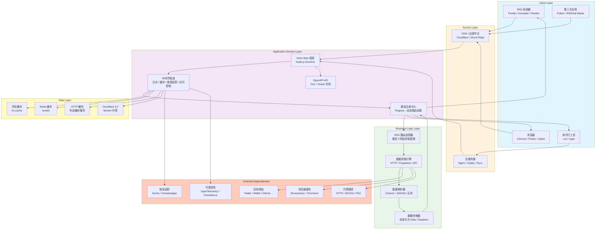
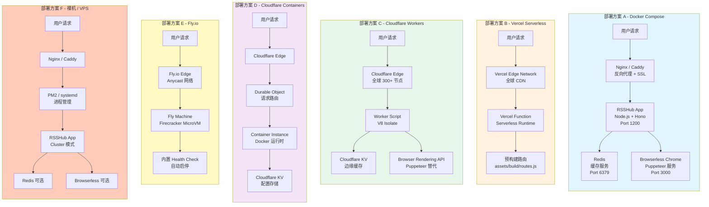

# RSSHub 系统架构图 (System Architecture)

## 1. 高层系统架构图



### 图表解释

#### 1. 概述
这张图展示了 RSSHub 系统的高层架构，采用经典的分层架构模式，从客户端请求到数据响应的完整链路。RSSHub 作为 RSS 生成服务，核心职责是将各种网站内容转换为标准化的 RSS/Atom/JSON Feed 格式。

#### 2. 关键元素说明
- **客户端层**：RSSHub 的消费者包括 RSS 阅读器（Feedly、Inoreader）、浏览器、命令行工具和第三方应用（如 Follow、RSSHub-Radar 浏览器扩展）。
- **接入层**：通过 CDN/边缘节点（Cloudflare、Vercel Edge）和负载均衡（Nginx、Caddy、Fly.io）处理流量入口，提供 SSL 终止和请求分发。
- **应用服务层**：基于 Hono Web 框架构建，包含中间件管道（日志、缓存、错误追踪、访问控制）、路由注册中心（动态加载数百个路由）和 OpenAPI API（基于 Zod + Scalar 提供交互式文档）。
- **业务逻辑层**：核心 RSS 生成逻辑，包含数百个网站适配器、数据抓取引擎（HTTP 请求、Puppeteer 浏览器、第三方 API）、数据解析器（Cheerio、JSDOM）和数据转换器（将原始数据标准化为 `Data` / `DataItem` 类型）。
- **数据层**：多级缓存策略，包括内存缓存（lru-cache）、Redis 缓存（ioredis）、HTTP 外部缓存服务和 Cloudflare KV（Worker 环境专用）。
- **外部依赖层**：目标网站（被抓取的内容源）、浏览器服务（Browserless/Chromium 用于反爬场景）、代理服务（HTTP/SOCKS/PAC 用于绕过限制）、错误追踪（Sentry/Honeybadger）和可观测性（OpenTelemetry/Prometheus）。

#### 3. 关键流程/关系说明
- **请求处理流程**：客户端请求 → 接入层（CDN/负载均衡）→ Hono 应用 → 中间件管道（日志、追踪、访问控制等）→ 路由注册中心匹配路由 → 业务逻辑层抓取和解析数据 → 数据层缓存结果 → 视图层渲染 RSS/XML/JSON → 返回客户端。
- **缓存策略**：请求首先经过缓存中间件检查，命中缓存直接返回；未命中则执行业务逻辑，结果写入缓存。支持内存、Redis、HTTP 和 KV 四种后端，根据部署环境自动选择。
- **数据抓取流程**：路由 handler 调用抓取引擎 → 根据目标网站反爬强度选择 HTTP 请求或 Puppeteer 浏览器 → 通过代理服务绕过地域/频率限制 → 使用 Cheerio/JSDOM 解析 HTML → 提取结构化数据 → 转换为标准 `Data` 对象。

#### 4. 设计亮点
- **分层解耦**：各层职责清晰，业务逻辑层只关注数据抓取和转换，不关心 HTTP 协议细节；应用服务层只关注请求处理和路由分发，不关注具体网站逻辑。
- **多级缓存**：从内存到 Redis 到 HTTP 缓存，层层递进，既保证了单机性能，又支持分布式部署。
- **动态路由加载**：路由注册中心在启动时自动扫描和加载路由模块，新增网站适配无需修改核心代码。
- **多环境适配**：同一套业务逻辑通过不同的入口文件和配置文件，可以运行在 Node.js、Docker、Vercel、Cloudflare Worker 等多种环境。

#### 5. 使用建议
- 这张图适合用于理解 RSSHub 系统的整体数据流和组件协作关系。
- 当需要优化系统性能时，重点关注数据层缓存策略和接入层的负载均衡配置。
- 当需要新增网站适配时，重点关注业务逻辑层的路由适配器和数据抓取引擎。
- 当需要排查请求问题时，按照从接入层到应用服务层再到业务逻辑层的顺序逐层定位。

---

## 2. 详细技术栈组件图

```mermaid
graph TB
    subgraph 运行时 [Runtime]
        RT1[Node.js 24+]
        RT2[Cloudflare Workers<br/>V8 Isolate]
        RT3[Docker Container<br/>Debian Bookworm]
    end

    subgraph Web框架 [Web Framework]
        WF1[Hono 4.x]
        WF2[@hono/node-server]
        WF3[@hono/zod-openapi]
        WF4[hono/jsx-renderer]
        WF5[hono/compress]
        WF6[hono/trailing-slash]
    end

    subgraph 数据抓取 [Data Fetching]
        DF1[ofetch 1.x<br/>HTTP 客户端]
        DF2[got 15.x<br/>流式请求]
        DF3[rebrowser-puppeteer 24.x<br/>无头浏览器]
        DF4[puppeteer-real-browser 1.x<br/>真实浏览器]
        DF5[cheerio 1.x<br/>服务器端 jQuery]
        DF6[jsdom 29.x<br/>完整 DOM 实现]
        DF7[undici 7.x<br/>Node.js HTTP]
    end

    subgraph 缓存 [Caching]
        CA1[lru-cache 11.x<br/>内存 LRU]
        CA2[ioredis 5.x<br/>Redis 客户端]
        CA3[Cloudflare KV<br/>边缘键值存储]
    end

    subgraph 数据处理 [Data Processing]
        DP1[dayjs 1.x<br/>日期处理]
        DP2[iconv-lite 0.7.x<br/>编码转换]
        DP3[html-to-text 9.x<br/>HTML 转文本]
        DP4[sanitize-html 2.x<br/>HTML 净化]
        DP5[markdown-it 14.x<br/>Markdown 渲染]
        DP6[entities 8.x<br/>HTML 实体解码]
        DP7[query-string 9.x<br/>URL 参数解析]
    end

    subgraph 安全与监控 [Security & Monitoring]
        SM1[@sentry/node 10.x<br/>错误追踪]
        SM2[@honeybadger-io/js 6.x<br/>错误监控]
        SM3[@opentelemetry/* 0.2xx<br/>链路追踪]
        SM4[winston 3.x<br/>日志记录]
        SM5[proxy-chain 2.x<br/>代理链]
        SM6[https-proxy-agent 9.x<br/>HTTPS 代理]
        SM7[socks-proxy-agent 10.x<br/>SOCKS 代理]
        SM8[pac-proxy-agent 9.x<br/>PAC 代理]
    end

    subgraph 构建工具 [Build Tools]
        BT1[TypeScript 5.9]
        BT2[tsdown 0.21.x<br/>打包工具]
        BT3[vitest 4.x<br/>测试框架]
        BT4[oxlint 1.61<br/>代码检查]
        BT5[eslint 10.x<br/>代码规范]
        BT6[tsx 4.x<br/>TypeScript 执行]
    end

    subgraph 部署平台 [Deployment Platforms]
        DP1[Docker / Docker Compose]
        DP2[Vercel Serverless]
        DP3[Cloudflare Workers]
        DP4[Cloudflare Containers]
        DP5[Fly.io]
        DP6[裸机 / VPS]
    end

    RT1 --> WF1
    RT2 --> WF1
    RT3 --> WF1

    WF1 --> WF2
    WF1 --> WF3
    WF1 --> WF4
    WF1 --> WF5
    WF1 --> WF6

    WF1 --> DF1
    WF1 --> DF2
    DF1 --> DF5
    DF1 --> DF6
    DF3 --> DF5
    DF3 --> DF6
    DF4 --> DF3

    WF1 --> CA1
    WF1 --> CA2
    RT2 --> CA3

    DF1 --> DP1
    DF1 --> DP2
    DF5 --> DP3
    DF5 --> DP4
    DF5 --> DP6
    WF1 --> DP5
    WF1 --> DP7

    WF1 --> SM1
    WF1 --> SM2
    WF1 --> SM3
    WF1 --> SM4
    DF1 --> SM5
    DF1 --> SM6
    DF1 --> SM7
    DF1 --> SM8

    BT1 --> BT2
    BT2 --> BT3
    BT2 --> BT4
    BT2 --> BT5
    BT1 --> BT6

    BT2 --> DP1
    BT2 --> DP2
    BT2 --> DP3
    BT2 --> DP4
    BT2 --> DP5
    BT2 --> DP6

    style 运行时 fill:#e1f5fe
    style Web框架 fill:#fff3e0
    style 数据抓取 fill:#e8f5e9
    style 缓存 fill:#fff9c4
    style 数据处理 fill:#f3e5f5
    style 安全与监控 fill:#ffccbc
    style 构建工具 fill:#d7ccc8
    style 部署平台 fill:#cfd8dc
```

### 图表解释

#### 1. 概述
这张图详细展示了 RSSHub 项目使用的技术栈组件及其之间的关系。RSSHub 采用现代化的 TypeScript 技术栈，涵盖了 Web 框架、数据抓取、缓存、数据处理、安全监控、构建工具和部署平台等多个维度。

#### 2. 关键元素说明
- **运行时**：支持 Node.js 24+（主运行环境）、Cloudflare Workers（V8 Isolate 边缘计算）和 Docker 容器（Debian Bookworm 基础镜像）。
- **Web 框架**：基于 Hono 4.x 构建，配合 `@hono/node-server` 提供 Node.js 服务器能力，`@hono/zod-openapi` 提供类型安全的 OpenAPI 支持，`hono/jsx-renderer` 提供 JSX 模板渲染，`hono/compress` 提供响应压缩，`hono/trailing-slash` 处理 URL 尾部斜杠。
- **数据抓取**：`ofetch` 是主要的 HTTP 客户端（基于 `undici`），`got` 用于流式请求；`rebrowser-puppeteer` 和 `puppeteer-real-browser` 提供无头/真实浏览器能力用于反爬场景；`cheerio` 和 `jsdom` 用于服务器端 HTML 解析。
- **缓存**：`lru-cache` 提供进程内内存缓存，`ioredis` 提供 Redis 缓存客户端，Cloudflare KV 用于 Worker 环境的边缘缓存。
- **数据处理**：`dayjs` 处理日期时间，`iconv-lite` 处理字符编码转换，`html-to-text` 和 `sanitize-html` 处理 HTML 内容，`markdown-it` 渲染 Markdown，`entities` 解码 HTML 实体，`query-string` 解析 URL 参数。
- **安全与监控**：`@sentry/node` 和 `@honeybadger-io/js` 提供错误追踪，`@opentelemetry/*` 提供分布式链路追踪，`winston` 提供结构化日志；代理相关库（`proxy-chain`、`https-proxy-agent`、`socks-proxy-agent`、`pac-proxy-agent`）支持多种代理协议。
- **构建工具**：TypeScript 5.9 作为主要开发语言，`tsdown` 用于打包（支持多目标输出），`vitest` 用于测试，`oxlint` 和 `eslint` 用于代码检查，`tsx` 用于开发时 TypeScript 直接执行。
- **部署平台**：支持 Docker/Docker Compose、Vercel Serverless、Cloudflare Workers、Cloudflare Containers、Fly.io 和裸机/VPS 六种部署方式。

#### 3. 关键流程/关系说明
- **请求处理链路**：Hono Web 框架接收请求 → 通过中间件管道处理 → 路由匹配 → 调用 ofetch/puppeteer 抓取数据 → 使用 cheerio/jsdom 解析 → 通过 dayjs/iconv-lite 等处理数据 → 返回标准化 Data 对象 → 经 JSX 渲染器输出 RSS/XML/JSON。
- **缓存链路**：请求到达时，缓存中间件通过 lru-cache/ioredis/KV 检查缓存 → 命中则直接返回 → 未命中则执行业务逻辑 → 结果写入缓存 → 返回响应。
- **构建链路**：TypeScript 源码 → tsdown 打包 → 输出到 dist/ / dist-worker/ / dist-container/ 等目录 → 对应不同部署平台的产物。
- **监控链路**：应用运行中产生日志（winston）→ 错误自动上报（Sentry/Honeybadger）→ 链路追踪（OpenTelemetry）→ 可观测性平台。

#### 4. 设计亮点
- **技术栈现代化**：采用 Hono 作为 Web 框架，相比 Express/Koa 更轻量且支持 Edge Runtime；采用 ofetch 替代 axios，API 更现代且支持自动重试。
- **多运行时支持**：同一套 TypeScript 源码通过 tsdown 的不同配置和条件编译，可以编译为 Node.js、Cloudflare Workers 和 Cloudflare Containers 三种目标产物。
- **数据抓取能力全面**：从简单的 HTTP 请求到复杂的 Puppeteer 浏览器渲染，覆盖了绝大多数网站的抓取需求；代理支持完善，支持 HTTP/SOCKS/PAC 多种协议。
- **缓存策略灵活**：四种缓存后端可根据部署环境灵活选择，内存缓存适合单机，Redis 适合分布式，HTTP 缓存适合自定义缓存服务，KV 适合边缘计算。

#### 5. 使用建议
- 这张图适合用于技术选型参考和团队技术分享。
- 当需要排查依赖冲突时，可以参考图中的版本号信息。
- 当需要新增功能时，先查看图中对应领域是否已有合适的库可用。
- 当需要选择部署方案时，可以参考部署平台部分了解各平台的支持情况。

---

## 3. 部署架构图



### 图表解释

#### 1. 概述
这张图展示了 RSSHub 支持的六种部署架构方案，从传统的 Docker Compose 到现代化的 Serverless 和边缘计算平台。每种方案都有其适用场景和权衡，用户可以根据自身需求选择合适的部署方式。

#### 2. 关键元素说明
- **部署方案 A - Docker Compose**：最完整的部署方案，包含 RSSHub 应用、Redis 缓存和 Browserless Chrome 三个服务。适合自托管用户，功能最全面，支持 Puppeteer 和 Redis 缓存。
- **部署方案 B - Vercel Serverless**：利用 Vercel 的 Serverless 函数和全球 CDN，无需维护服务器。路由在构建时预编译为 `routes.js`，启动速度快，但受 Serverless 限制（冷启动、执行时间限制）。
- **部署方案 C - Cloudflare Workers**：运行在 Cloudflare 全球边缘节点上，请求在离用户最近的节点处理。使用 KV 作为缓存，Browser Rendering API 替代 Puppeteer。适合高并发、低延迟场景。
- **部署方案 D - Cloudflare Containers**：结合 Durable Object 和 Docker 容器的方案，在 Cloudflare 边缘运行容器化应用。通过 KV 存储配置，支持更复杂的运行时需求。
- **部署方案 E - Fly.io**：基于 Firecracker MicroVM 的部署方案，机器在空闲时自动挂起、有请求时自动启动。内置健康检查，适合成本敏感的场景。
- **部署方案 F - 裸机 / VPS**：最传统的部署方式，使用 Nginx/Caddy 作为反向代理，PM2 或 systemd 管理进程。支持 Node.js Cluster 模式利用多核 CPU，Redis 和 Browserless 可选部署。

#### 3. 关键流程/关系说明
- **Docker Compose 流程**：用户请求 → Nginx/Caddy（SSL 终止、反向代理）→ RSSHub App（Port 1200）→ 根据配置访问 Redis（缓存）或 Browserless（Puppeteer 渲染）。
- **Vercel 流程**：用户请求 → Vercel Edge CDN → Serverless Function → 加载预构建的 routes.js → 执行路由 handler → 返回响应。
- **Cloudflare Workers 流程**：用户请求 → Cloudflare Edge（最近节点）→ Worker Script（V8 Isolate）→ KV 缓存检查 → 如需 Puppeteer 调用 Browser Rendering API → 返回响应。
- **Cloudflare Containers 流程**：用户请求 → Cloudflare Edge → Durable Object（请求路由和状态管理）→ Container Instance（Docker 运行时）→ KV（配置读取）→ 返回响应。
- **Fly.io 流程**：用户请求 → Fly.io Anycast 网络 → Fly Machine（Firecracker MicroVM）→ 健康检查确保服务可用 → 返回响应。
- **裸机/VPS 流程**：用户请求 → Nginx/Caddy → PM2/systemd 管理的 RSSHub 进程（Cluster 模式）→ 可选 Redis/Browserless → 返回响应。

#### 4. 设计亮点
- **一套代码，多种部署**：同一套 TypeScript 源码通过不同的构建配置（`tsdown.config.ts`、`tsdown-worker.config.ts`、`tsdown-container.config.ts`、`tsdown-vercel.config.ts`）生成对应不同平台的产物。
- **环境自适应**：应用通过 `isWorker`、`isPackage` 等标志自动检测运行环境，加载对应的缓存模块（内存/Redis/KV）和中间件组合。
- **Worker 环境优化**：Cloudflare Workers 版本去除了重量级中间件（honeybadger、sentry、antiHotlink、parameter），使用 KV 替代 Redis，使用 Browser Rendering API 替代 Puppeteer，确保在 10ms/30ms CPU 时间限制内完成请求。
- **容器化优化**：Docker 镜像采用多阶段构建，分离依赖安装、构建和运行阶段，最终镜像仅包含运行所需的文件，体积最小化。

#### 5. 使用建议
- **功能最全**：选择 Docker Compose 方案，支持所有功能（Puppeteer、Redis 缓存、完整中间件）。
- **最简单**：选择 Vercel 方案，一键部署，自动 SSL，全球 CDN。
- **性能最好**：选择 Cloudflare Workers 方案，边缘计算、全球低延迟、高并发。
- **成本最低**：选择 Fly.io 方案，按实际运行时间计费，空闲时自动挂起。
- **最灵活**：选择裸机/VPS 方案，完全控制运行环境，支持 Cluster 模式利用多核。
- **容器化边缘**：选择 Cloudflare Containers 方案，在边缘运行容器，兼顾灵活性和全球分发。

---

*生成时间: 2026-05-13*
*模式: 深度*
*所属项目: RSSHub*
*文件包含: 3 张图*
