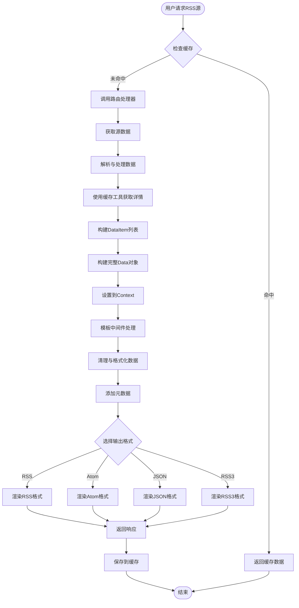
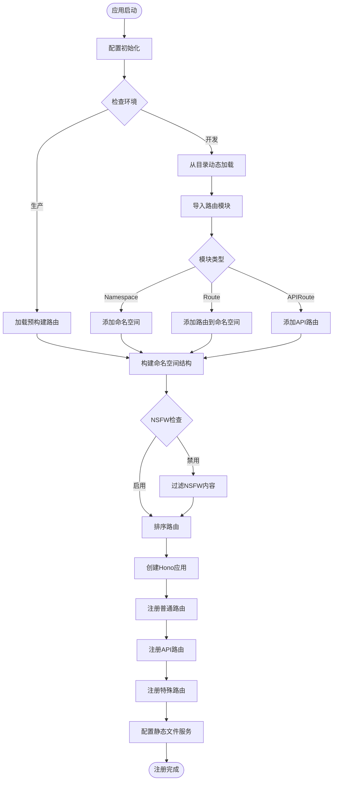
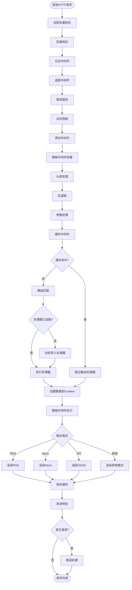
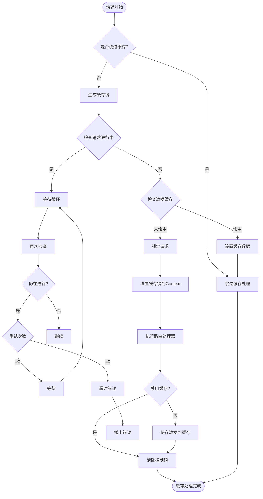

# RSSHub 业务流程图

本文档详细描述了 RSSHub 的核心业务流程，包含四个主要业务域的深度流程图。

---

## 1. RSS 生成流程

### 流程图

### 五段式解释

#### 1. 启动与缓存检查
RSS 生成流程从用户请求特定 RSS 源开始。系统首先检查缓存中是否存在该请求的有效数据。如果缓存命中，直接返回缓存数据，避免重复处理，这是 RSSHub 提升性能的关键机制。

#### 2. 路由处理器执行
当缓存未命中时，系统调用匹配路由的处理器函数。处理器的主要职责是从目标网站获取原始数据。这通常涉及 HTTP 请求、HTML 解析、API 调用等操作。路由处理器是 RSSHub 扩展性的核心，每个数据源都有自己的处理器实现。

#### 3. 数据处理与构建
获取到原始数据后，处理器对数据进行解析和清洗，提取有用信息。然后构建符合 RSSHub `Data` 类型规范的数据结构，包括标题、描述、链接和条目列表。每个条目都包含标题、描述、发布时间等详细信息。

#### 4. 模板处理与格式化
构建好的数据通过模板中间件进行处理。中间件负责数据清理（如去除多余空白、限制标题长度）、添加元数据（如最后构建时间、TTL），并根据用户请求的格式参数选择输出格式。支持 RSS、Atom、JSON、RSS3 等多种格式。

#### 5. 响应与缓存保存
格式化后的数据作为响应返回给用户。同时，新生成的数据被保存到缓存中，以便后续请求可以直接使用，减少对源网站的请求压力，提升响应速度。

---

## 2. 路由注册流程

### 流程图

### 五段式解释

#### 1. 启动与环境判断
路由注册流程在 RSSHub 应用启动时开始。系统首先进行配置初始化，然后根据运行环境（生产、开发、测试）选择不同的路由加载策略。生产环境使用预构建的路由文件以提升启动速度，开发环境则从目录动态加载，便于开发调试。

#### 2. 模块导入与分类
路由模块从 `lib/routes` 目录加载。每个模块可以是三种类型之一：命名空间（Namespace）定义模块的基本信息，普通路由（Route）定义 RSS 订阅源，API 路由（APIRoute）定义辅助 API 接口。系统根据模块类型进行分类处理。

#### 3. 命名空间结构构建
系统构建完整的命名空间层次结构。每个命名空间包含其下的所有路由和 API 路由，形成清晰的组织结构。同时进行 NSFW 内容检查，如果配置禁用了 NSFW 内容，则过滤掉相关路由。

#### 4. 路由排序与注册
路由按照优先级排序：字面量路径优先于参数路径，确保路由匹配的正确性。然后将排序后的路由注册到 Hono 应用中，每个路由都被包装在一个处理函数中，支持动态加载和懒执行。

#### 5. 特殊路由与完成
最后注册特殊路由（如首页、健康检查、robots.txt 等），并配置静态文件服务。至此，所有路由注册完成，应用可以开始接收和处理请求。

---

## 3. 请求处理流程

### 流程图

### 五段式解释

#### 1. 请求预处理
请求处理从接收 HTTP 请求开始，首先经过一系列预处理中间件：去除 URL 末尾斜杠、启用响应压缩、记录访问日志、添加追踪信息、错误报告配置、访问控制检查、调试信息处理等。这些中间件为后续处理做好准备。

#### 2. 安全与参数处理
接着处理安全相关中间件：设置 HTTP 头部、反盗链检查、参数解析与处理。然后进入缓存中间件，这是请求处理的关键环节，检查请求是否有有效缓存。

#### 3. 路由匹配与执行
如果缓存未命中，系统进行路由匹配，找到对应的路由处理器。如果处理器尚未加载（生产环境），则动态导入。然后执行路由处理器，获取数据并设置到上下文中。

#### 4. 响应格式化
模板中间件根据数据和用户请求的格式参数，选择合适的渲染方式：API 数据返回 JSON，普通数据根据 format 参数渲染为 RSS、Atom 或其他格式。同时进行数据清理、添加元数据等处理。

#### 5. 完成与错误处理
渲染完成后，将新数据保存到缓存，发送响应给用户。如果处理过程中发生任何错误，错误处理中间件会捕获并返回适当的错误响应。

---

## 4. 缓存管理流程

### 流程图

### 五段式解释

#### 1. 缓存前置检查
缓存管理流程首先检查请求是否在缓存绕过列表中（如首页、静态文件等）。如果是，则直接跳过缓存处理。否则，生成唯一的缓存键，使用 XXH64 哈希算法缩小键的大小，提高存储效率。

#### 2. 并发控制检查
系统检查该路径是否已有其他请求正在处理中。如果是，则进入等待循环，定期检查状态，避免重复请求对源网站造成压力。如果等待超时，则返回请求进行中的错误。

#### 3. 数据缓存检查
如果没有进行中的请求，检查数据缓存是否存在。如果缓存命中，直接使用缓存数据；如果未命中，设置控制锁标记该路径正在处理中，防止并发重复请求。

#### 4. 数据处理与缓存保存
路由处理器执行完成后，检查响应是否标记为不缓存。如果不是，则将数据序列化为 JSON 保存到缓存，并设置过期时间。最后清除控制锁，允许后续请求继续处理。

#### 5. 错误处理
如果处理过程中发生错误，确保清除控制锁，避免死锁状态。然后将错误重新抛出，由上层错误处理中间件处理。

---

## 总结

RSSHub 的业务流程设计体现了以下核心特点：

1. **模块化设计**：路由、缓存、模板各组件职责清晰，便于维护和扩展
2. **性能优先**：多级缓存策略，最大限度减少源站压力
3. **并发安全**：完善的并发控制机制，避免重复请求
4. **多格式支持**：灵活的输出格式，满足不同场景需求
5. **动态加载**：生产环境预构建，开发环境动态加载，兼顾性能和开发体验
