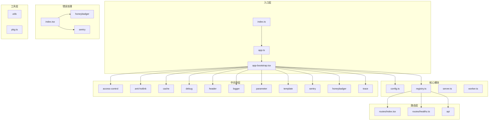
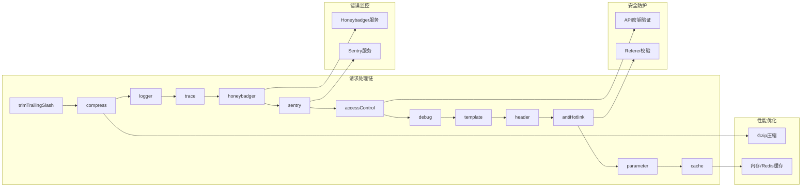

# RSSHub 模块结构图 (Module Structure)

## 1. 整体模块架构图



### 图表解释

#### 1. 整体概述
- 这张图讲的是：RSSHub 项目的整体模块架构，展示了从入口到各功能模块的组织结构
- 解决什么问题：清晰展示项目的模块划分和依赖关系
- 核心看点：分层架构设计，中间件链式处理

#### 2. 关键元素说明
- **入口层**：负责启动服务器，支持集群模式和单进程模式
- **核心模块**：配置管理、路由注册、服务器和 Worker 管理
- **中间件层**：10+ 个中间件组成的处理链，包括访问控制、缓存、日志、参数校验等
- **错误处理**：统一的错误处理机制，集成多种错误追踪服务
- **路由层**：API 路由和健康检查端点
- **工具层**：通用工具函数和包管理

#### 3. 关键流程/关系说明
- 请求从 `index.ts` 进入，经过 `app.ts` 初始化请求重写器
- `app-bootstrap.tsx` 创建 Hono 应用并注册所有中间件
- 中间件按顺序执行：trimTrailingSlash → compress → logger → trace → honeybadger → sentry → accessControl → debug → template → header → antiHotlink → parameter → cache
- 最后路由到 registry 或 api 处理具体请求

#### 4. 关键技术解释
- **Hono 框架**：高性能的 Node.js HTTP 框架，支持中间件链式处理
- **集群模式**：支持多核 CPU 并行处理，提升吞吐量
- **中间件模式**：每个中间件负责单一职责，通过链式组合实现复杂功能

#### 5. 设计意图
- 为什么要这样设计：采用分层架构，职责清晰，易于扩展和维护
- 解决了什么痛点：避免单体应用的复杂性，提高代码复用率
- 带来了什么好处：模块化设计使得每个模块可以独立开发、测试和部署
- 如果不这样会怎样：代码耦合度高，难以维护和扩展

---

## 2. 中间件模块详细图



### 图表解释

#### 1. 整体概述
- 这张图讲的是：中间件处理链的详细结构和各中间件的职责划分
- 解决什么问题：展示请求如何通过中间件链逐步处理
- 核心看点：中间件的顺序安排和职责分工

#### 2. 关键元素说明
- **trimTrailingSlash**：移除 URL 末尾斜杠
- **compress**：响应内容压缩
- **logger**：请求日志记录
- **trace**：分布式链路追踪
- **honeybadger/sentry**：错误监控和上报
- **accessControl**：访问权限控制
- **debug**：调试信息输出
- **template**：模板渲染配置
- **header**：响应头设置
- **antiHotlink**：防盗链保护
- **parameter**：参数校验和处理
- **cache**：响应缓存

#### 3. 关键流程/关系说明
- 请求按顺序经过每个中间件，每个中间件可以修改请求或响应
- 错误监控中间件（honeybadger/sentry）在处理链早期注册，以便捕获后续所有错误
- 安全防护中间件（accessControl/antiHotlink）在参数处理之前执行
- 缓存中间件在最后，对最终响应进行缓存

#### 4. 关键技术解释
- **洋葱模型**：中间件采用洋葱模型，请求进入时按顺序执行，响应返回时逆序执行
- **错误边界**：honeybadger 和 sentry 作为错误边界，捕获未处理异常

#### 5. 设计意图
- 为什么要这样设计：中间件顺序经过精心安排，确保安全检查在业务处理前完成
- 解决了什么痛点：避免重复代码，提高代码复用
- 带来了什么好处：灵活组合中间件，按需启用或禁用功能
- 如果不这样会怎样：代码重复，难以维护和扩展

---

## 3. 模块依赖关系图

```mermaid
graph TD
    subgraph 外部依赖
        A[@hono/node-server]
        B[Hono]
        C[ofetch]
        D[dotenv]
    end

    subgraph 核心模块
        E[index.ts] --> F[app.ts]
        F --> G[app-bootstrap.tsx]
        G --> H[registry.ts]
        G --> I[config.ts]
        G --> J[middleware/*]
        H --> K[routes/*]
        H --> L[api/*]
    end

    subgraph 工具模块
        M[utils/logger]
        N[utils/common-utils]
        O[pkg.ts]
    end

    subgraph 错误处理
        P[errors/index.tsx]
        Q[middleware/honeybadger]
        R[middleware/sentry]
    end

    E --> A
    G --> B
    I --> C
    I --> D
    E --> M
    J --> M
    P --> Q
    P --> R
    G --> P
```

### 图表解释

#### 1. 整体概述
- 这张图讲的是：模块之间的依赖关系和外部依赖
- 解决什么问题：展示项目的依赖结构，帮助理解代码组织
- 核心看点：清晰的依赖层次和外部依赖管理

#### 2. 关键元素说明
- **外部依赖**：Hono 框架、ofetch HTTP 客户端、dotenv 环境变量
- **核心模块**：入口、应用配置、路由注册
- **工具模块**：日志工具、通用工具函数、包信息
- **错误处理**：统一错误处理和监控集成

#### 3. 关键流程/关系说明
- 入口模块依赖 Hono 服务器和日志工具
- 应用引导模块依赖所有中间件和错误处理
- 路由注册模块依赖具体的路由实现
- 配置模块依赖环境变量和 HTTP 客户端

#### 4. 关键技术解释
- **依赖注入**：通过 import 语句实现模块间的依赖关系
- **环境变量管理**：使用 dotenv 加载配置

#### 5. 设计意图
- 为什么要这样设计：模块化依赖，降低耦合度
- 解决了什么痛点：便于单独测试和替换模块
- 带来了什么好处：提高代码可维护性和可测试性
- 如果不这样会怎样：模块间耦合紧密，难以重构和测试

---
*生成时间: 2026-05-13*
*模式: 深度*
*所属项目: RSSHub*
*文件包含: 3 张图*
