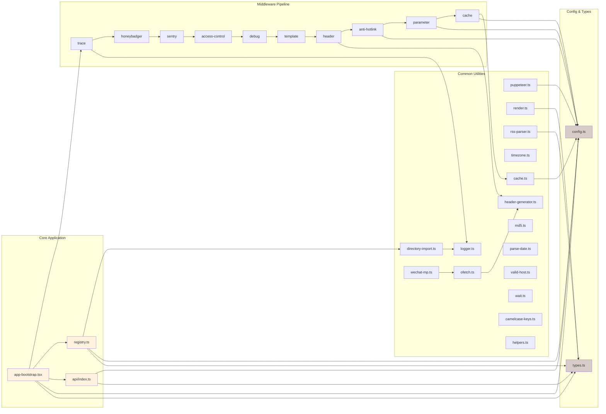
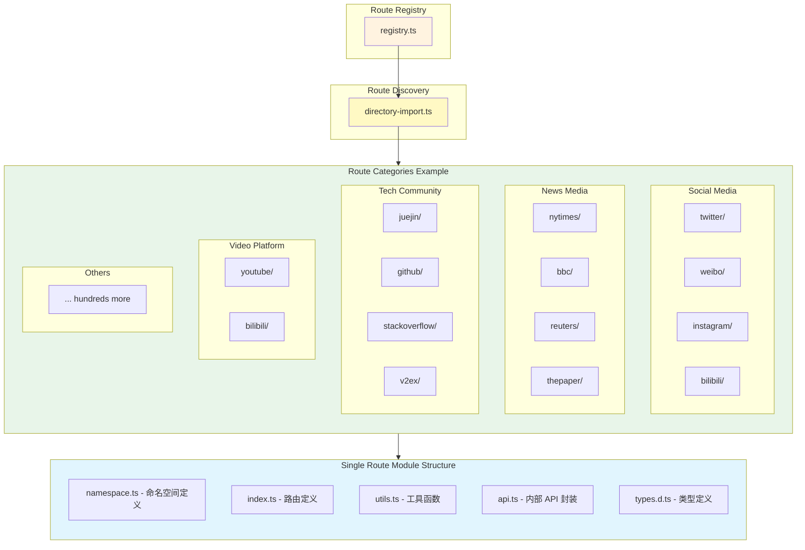

# RSSHub 模块结构图 (Module Structure)

## 1. 整体模块结构图

```mermaid
graph TD
    subgraph 入口层 [Entry Layer]
        E1[index.ts - Node Server]
        E2[server.ts - Vercel]
        E3[worker.ts - Cloudflare Worker]
    end

    subgraph 应用层 [Application Layer]
        A1[app-bootstrap.tsx]
        A2[app.worker.tsx]
        A3[registry.ts]
        A4[api/index.ts]
    end

    subgraph 中间件层 [Middleware Layer]
        M1[access-control]
        M2[anti-hotlink]
        M3[cache]
        M4[debug]
        M5[header]
        M6[honeybadger]
        M7[logger]
        M8[parameter]
        M9[sentry]
        M10[template]
        M11[trace]
    end

    subgraph 路由层 [Route Layer]
        R1[routes/ - 内置路由]
        R2[routes-deprecated/ - 旧路由]
    end

    subgraph 视图层 [View Layer]
        V1[atom.tsx]
        V2[error.tsx]
        V3[index.tsx]
        V4[json.ts]
        V5[layout.tsx]
        V6[rss.tsx]
        V7[rss3.ts]
    end

    subgraph 工具层 [Utility Layer]
        U1[common-utils]
        U2[logger]
        U3[got / ofetch]
        U4[puppeteer-utils]
        U5[render]
        U6[rss-parser]
        U7[timezone]
        U8[directory-import]
        U9[header-generator]
        U10[cache]
        U11[md5]
        U12[parse-date]
        U13[valid-host]
        U14[wait]
        U15[wechat-mp]
        U16[camelcase-keys]
        U17[helpers]
    end

    subgraph 错误处理层 [Error Layer]
        ERR1[index.tsx - 错误处理器]
        ERR2[honeybadger.test.ts]
        ERR3[sentry.test.ts]
    end

    subgraph 配置层 [Config Layer]
        C1[config.ts]
        C2[types.ts]
        C3[pkg.ts]
    end

    subgraph 外部依赖 [External Dependencies]
        EXT1[Hono Web Framework]
        EXT2[@hono/node-server]
        EXT3[@hono/zod-openapi]
        EXT4[Scalar API Docs]
        EXT5[Cheerio / JSDOM]
        EXT6[Puppeteer]
        EXT7[Redis / ioredis]
        EXT8[Winston Logger]
        EXT9[OpenTelemetry]
    end

    E1 --> A1
    E2 --> A1
    E3 --> A2

    A1 --> M1
    A1 --> M2
    A1 --> M3
    A1 --> M4
    A1 --> M5
    A1 --> M6
    A1 --> M7
    A1 --> M8
    A1 --> M9
    A1 --> M10
    A1 --> M11

    A1 --> A3
    A1 --> A4
    A2 --> A3
    A2 --> A4

    A3 --> R1
    A3 --> R2
    A4 --> R1

    R1 --> V1
    R1 --> V2
    R1 --> V3
    R1 --> V4
    R1 --> V5
    R1 --> V6
    R1 --> V7

    R1 --> U1
    R1 --> U2
    R1 --> U3
    R1 --> U4
    R1 --> U5
    R1 --> U6
    R1 --> U7
    R1 --> U8
    R1 --> U9
    R1 --> U10
    R1 --> U11
    R1 --> U12
    R1 --> U13
    R1 --> U14
    R1 --> U15
    R1 --> U16
    R1 --> U17

    A1 --> ERR1
    A2 --> ERR1

    A1 --> C1
    A3 --> C1
    A4 --> C1
    A1 --> C2
    A3 --> C2
    A4 --> C2

    A1 --> EXT1
    A1 --> EXT2
    A1 --> EXT3
    A4 --> EXT3
    A4 --> EXT4
    R1 --> EXT5
    R1 --> EXT6
    M3 --> EXT7
    M7 --> EXT8
    M6 --> EXT9
    M9 --> EXT9

    style 入口层 fill:#e1f5fe
    style 应用层 fill:#fff3e0
    style 中间件层 fill:#f3e5f5
    style 路由层 fill:#e8f5e9
    style 视图层 fill:#fce4ec
    style 工具层 fill:#fff9c4
    style 错误处理层 fill:#ffccbc
    style 配置层 fill:#d7ccc8
    style 外部依赖 fill:#cfd8dc
```

### 图表解释

#### 1. 概述
这张图展示了 RSSHub 项目的整体模块组织结构。RSSHub 是一个基于 Hono 框架的 RSS 生成服务，采用分层架构设计，从入口层到路由层、中间件层、视图层和工具层，各层职责清晰，模块之间通过明确的依赖关系协作。

#### 2. 关键元素说明
- **入口层 (Entry Layer)**：提供三种运行模式——Node Server (`index.ts`)、Vercel Serverless (`server.ts`)、Cloudflare Worker (`worker.ts`)，分别对应不同的部署环境。
- **应用层 (Application Layer)**：`app-bootstrap.tsx` 是核心应用组装器，负责挂载中间件和路由；`registry.ts` 负责动态加载和注册所有 RSS 路由；`api/index.ts` 提供 OpenAPI 规范的 REST API。
- **中间件层 (Middleware Layer)**：包含 11 个中间件，覆盖访问控制、防盗链、缓存、调试、请求头处理、错误追踪、日志、参数处理、模板渲染和链路追踪等功能。
- **路由层 (Route Layer)**：`lib/routes/` 下包含数百个网站适配器，每个适配器对应一个网站的 RSS 源生成逻辑；`routes-deprecated/` 存放旧版路由。
- **视图层 (View Layer)**：负责将路由返回的数据渲染为不同格式的输出，包括 RSS、Atom、JSON、RSS3 等。
- **工具层 (Utility Layer)**：提供通用的工具函数，如 HTTP 请求封装、HTML 解析、日期处理、缓存、日志、Puppeteer 浏览器控制等。
- **错误处理层 (Error Layer)**：集中处理应用错误，并集成 Honeybadger 和 Sentry 进行错误上报。
- **配置层 (Config Layer)**：`config.ts` 管理所有环境变量和配置项；`types.ts` 定义核心 TypeScript 类型；`pkg.ts` 处理包信息。

#### 3. 关键流程/关系说明
- **请求处理流程**：入口层接收请求 → 应用层通过 Hono 路由分发 → 中间件层依次处理（日志 → 链路追踪 → 错误追踪 → 访问控制 → 调试 → 模板 → 请求头 → 防盗链 → 参数 → 缓存）→ 路由层匹配具体路由 → 视图层渲染输出。
- **路由注册流程**：`registry.ts` 在启动时通过 `directoryImport` 动态扫描 `lib/routes/` 目录，加载所有 namespace 和 route 模块，构建路由表。
- **数据流**：路由 handler 从目标网站抓取数据 → 使用工具层的解析函数处理 → 返回标准化的 `Data` 对象 → 视图层渲染为 RSS/XML/JSON。

#### 4. 设计亮点
- **多平台部署**：通过不同的入口文件（`index.ts` / `server.ts` / `worker.ts`）和对应的 app 组装文件（`app-bootstrap.tsx` / `app.worker.tsx`），同一套核心代码可以部署到 Node.js、Vercel 和 Cloudflare Worker 三种环境。
- **中间件管道**：采用 Hono 的中间件机制，将横切关注点（日志、缓存、错误处理等）与业务逻辑解耦。
- **动态路由加载**：通过 `directoryImport` 实现路由的自动发现和懒加载，新增路由只需在 `lib/routes/` 下创建文件即可，无需修改注册逻辑。
- **标准化数据模型**：`types.ts` 中定义的 `Data` 和 `DataItem` 类型统一了所有路由的输出格式，视图层可以统一渲染。

#### 5. 使用建议
- 这张图适合用于理解 RSSHub 的整体架构和模块职责划分。
- 当需要新增一个网站的 RSS 适配时，重点关注路由层和工具层。
- 当需要修改请求处理流程（如增加新的全局处理逻辑）时，重点关注中间件层。
- 当需要排查部署相关问题时，重点关注入口层和应用层的对应关系。

---

## 2. 核心模块依赖关系图



### 图表解释

#### 1. 概述
这张图聚焦于 RSSHub 核心模块之间的依赖关系，展示了应用启动时各模块的组装顺序和运行时依赖。重点呈现了中间件管道的执行顺序、registry 与工具模块的协作关系。

#### 2. 关键元素说明
- **app-bootstrap.tsx**：核心应用组装器，创建 Hono 实例并按顺序挂载所有中间件和路由。
- **registry.ts**：路由注册中心，负责扫描、加载和排序所有路由模块。
- **api/index.ts**：OpenAPI 接口层，基于 `@hono/zod-openapi` 提供类型安全的 REST API。
- **中间件管道**：按固定顺序执行的 10 个中间件，每个中间件处理特定的横切关注点。
- **config.ts & types.ts**：被几乎所有模块依赖的基础设施，提供配置和类型定义。
- **通用工具**：被路由和中间件共享的工具函数集合。

#### 3. 关键流程/关系说明
- **中间件执行顺序**：`trace` → `honeybadger` → `sentry` → `access-control` → `debug` → `template` → `header` → `anti-hotlink` → `parameter` → `cache`。这个顺序确保了：
  1. 链路追踪最先开始，覆盖完整请求生命周期
  2. 错误追踪中间件在业务逻辑之前挂载，可以捕获后续中间件和路由的错误
  3. 缓存在最后，确保缓存的是经过所有前置处理后的结果
- **Registry 依赖关系**：`registry.ts` 依赖 `directory-import` 进行路由扫描，依赖 `config.ts` 判断是否禁用 NSFW 路由，依赖 `types.ts` 进行类型检查。
- **工具模块复用**：`ofetch.ts` 封装了带代理和请求头管理的 HTTP 客户端，被大量路由模块使用；`puppeteer.ts` 提供无头浏览器能力，用于反爬严格的网站。

#### 4. 设计亮点
- **中间件顺序的精心设计**：错误追踪中间件在业务逻辑之前，确保能捕获所有异常；缓存在参数处理之后，确保不同参数的请求走不同的缓存键。
- **配置中心化**：所有环境变量和配置项集中在 `config.ts` 中解析和管理，避免了配置散落在各模块中。
- **类型驱动**：`types.ts` 中定义的 `Data`、`DataItem`、`Route`、`Namespace` 等类型是整个系统的契约，确保了路由开发者和视图层开发者之间的接口一致性。

#### 5. 使用建议
- 当排查请求处理问题时，按照中间件顺序逐一检查各环节。
- 当开发新路由时，参考 `types.ts` 中的类型定义确保输出格式正确。
- 当修改配置相关逻辑时，只需关注 `config.ts` 一处即可。

---

## 3. 路由模块组织结构图



### 图表解释

#### 1. 概述
这张图展示了 RSSHub 路由层的组织结构。RSSHub 的核心价值在于为数百个网站提供 RSS 适配，每个网站对应一个或多个路由模块。路由模块按网站域名组织，采用统一的文件结构。

#### 2. 关键元素说明
- **registry.ts**：路由注册中心，在应用启动时扫描 `lib/routes/` 目录，动态加载所有路由模块。
- **directory-import.ts**：通用的目录扫描工具，被 registry 用于发现和导入路由文件。
- **路由分类**：路由按网站类型自然分组，包括社交媒体、新闻媒体、技术社区、视频平台等数十个类别。
- **单一路由模块**：每个网站的路由模块通常包含 2-4 个文件：
  - `namespace.ts`：定义命名空间元数据（名称、URL、分类、描述等）
  - `index.ts` 或其他 `.ts` 文件：定义具体的路由（path、handler、参数等）
  - `utils.ts`：该网站特有的工具函数（如请求封装、HTML 解析等）
  - `api.ts`：部分复杂路由会单独封装内部 API 调用层
  - `types.d.ts`：类型定义文件（可选）

#### 3. 关键流程/关系说明
- **路由发现流程**：`registry.ts` → `directoryImport('./routes')` → 扫描所有子目录 → 加载 `namespace.ts` 和各个路由文件 → 构建 `namespaces` 对象 → 注册到 Hono 路由表。
- **路由匹配流程**：请求到达 → Hono 按路径匹配 → 找到对应 namespace 的 subApp → 在 subApp 中匹配具体 route → 执行 route handler → 返回 Data 对象 → 经中间件和视图层渲染输出。
- **模块复用**：同一网站下的多个路由通常共享 `utils.ts` 中的请求和解析逻辑，例如 `twitter/` 下的所有路由共享 Twitter API 的封装。

#### 4. 设计亮点
- **约定优于配置**：路由模块只需按约定放置文件，无需手动注册，极大降低了新增路由的成本。
- **Namespace 隔离**：每个网站的路由挂载在自己的 namespace 路径下（如 `/twitter/user/:id`），避免了路由冲突。
- **统一的数据契约**：所有路由 handler 返回统一的 `Data` 类型，视图层可以无差别地渲染任何路由的输出。
- **懒加载**：生产环境下路由通过预构建的 `routes.js` 加载，开发环境下通过 `directoryImport` 动态加载，兼顾了启动速度和开发便利性。

#### 5. 使用建议
- 当需要新增一个网站的 RSS 适配时，在 `lib/routes/` 下创建以网站域名命名的目录，参考现有模块的文件结构。
- 当需要修改某个网站的抓取逻辑时，直接找到对应目录下的路由文件和 `utils.ts`。
- 当路由出现问题时，可以通过 `debug` 中间件查看请求匹配到了哪个路由。

---

*生成时间: 2026-05-13*
*模式: 深度*
*所属项目: RSSHub*
*文件包含: 3 张图*
